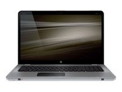
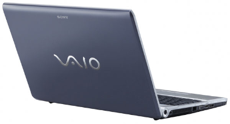

First of all, this is not a religious post. Its not a PC vs Mac post, I'm just fed up with the quality of hardware the PC manufacturers are putting out there.

2.5 years ago I switched from being a "PC guy" to my first Mac, and I was really impressed with the quality of the hardware and how it felt. It just felt solid. At that point I was very frustrated with the quality of PC hardware and constant trouble with both desktops and laptops I had bought for home use, but also at work. And I figured it was time to try something else. I was very happy with my switch.

About 2 months ago I decided to go out and buy a PC. Basically I needed it for Windows Phone 7 development, as the emulator for WP7 doesn't work with my virtualization software on the Mac, and also being out in the field doing quite a bit of work for Microsoft, I grew tired of having to have my MacBook Pro taking so much attention.

I researched quite a bit, I wanted a PC that looked nice, had the right spec in terms of performance and memory and also I was looking for one with similar keyboard as on the MacBook Pro - separated keys, as I find that type keyboard to be very efficient to write on. After a long look, I settled in on the HP Envy 17".

  
Looks nice, felt nice all the way from the packaging. Specs was awesome at the price they are selling it for. Got it and was really psyched (I LOVE HARDWARE). Turned it on; it was realllllly slow and the fan was going completely mad. Figured it might be a software issue, reinstalled windows looked for firmware updates, but didn't work out at all. Sent it back and got a new one within days. The new one was silent and very snappy, I was happy.

Since the PC will not serve as my main computer, I didn't get to use it much and it took a few days before I discovered an issue with it. Turns out that the keyboard was not mounted properly, so it was sticking out on one side and looked really bad (at least after one discovers it). Since one of my criteria was esthetics when buying a new computer, this drove me insane. Discovering this, I really started to look at the rest of the computer and really compare it to my MacBook Pro and I found more annoying things with it, not flaws, just things that annoyed me. Firstly, why is it that the screen on my MBP is about 1cm (half an inch) thick and on the Envy it was about double of that. Why did it weigh more than my MBP. Why wasn't it a unibody design. Plastic feeling.. Arghhh.. I was really annoyed with it. Sent it back, and got my money back this time. Didn't want to try out a third HP.

Went back to my research and looked for a day or so, looked at Dell - they had a few nice ones, but not in stock and frankly I wanted the hardware NOW. Settled in on what I really wanted to buy before I bought the Envy; a Sony Vaio. It looked nice, fit the pricerange, had almost the specs I wanted.  
  

  
What could go wrong. Well a lot, it turns out. The hardware seems quite OK, the build is not too shabby, very plastic, but I could learn to live it. But still, too thick monitor.  
Turning it on, booting into Windows, doing all the necessary initial settings for Windows and a Vaio wizard. First thing I started noticing, the screen - its really not bright as I expect. The Envy was really bright and crystal clear, this was dimmed. Figured it must be a setting. Nope. Then I started getting really annoyed with all the stickers I have to remove from the computer. It looks like a christmas tree. Flashy intel sticker, nvidia, windows, big fat Sony Vaio F-Series sticker, bluetooth and what not. Then I started noticing the fan constantly working - even when completely idle. Don't know why, can't figure out why. Sometimes it turns off, but for the most part you can hear it. I'm not used to that.

Getting over the fact that the hardware does not feel solid, and clearly lacks the production quality that I've grown used to from Apple, there is one more thing that really bugs me with PC manufacturers. Why are you putting all that crappy software on the machines. They come preinstalled with something like 50 apps, and they are mostly crappy. I can see why Microsoft wants to get them to realize they're ruining the Windows experience, because they really are! And most users don't necessarily know how to get it off their computer.  
  

One of the arguments I hear from people about Apple computers, are that they are so expensive. This is something I don't quite get. Going on my quest to find a PC I was aiming around the price range the MBP 15" is at. Sure, both the Envy and the Vaio have a few more features (a ton of connectors on both sides). But when the quality is so bad and their products aren't coming across as solid work - I really don't get it. For the most part I will not be needing all those added features (eSATA for one). I'm more than happy to add $100-$200 on the price if that means I get a computer that just works. You'd probably argue that Apple has their problems as well, sure they have. They've had bumps in the road for their hardware as well, but compared to PCs for my sake at least, I've not had anything but bumps in the road buying PC hardware. I've bought 5 Apple computers in 2.5 years and not had any problem with any of them. In the same timeframe I've bought 4 PCs, and had issues with all of them. So in my book thats pretty bad!  
  

My comment to the PC manufacturers; GET A GRIP. Start delivering quality hardware, stop creating bad user experiences by putting a shitload of software on them. Focus on the end-user!!

I will be sticking with the Vaio, not because I want to - but I really don't see a good alternative, at least not for the type of design I want for my computer (I don't want a Lenovo, because I think they look like crap).
