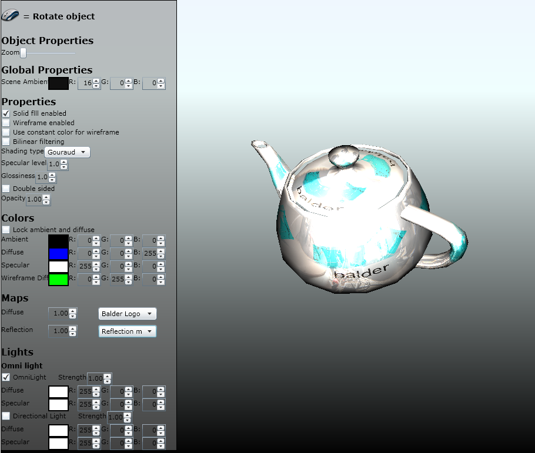

This is one of those classical summaries done by most bloggers around the world; what did I do in 2010 and whats going on in 2011.

2010 is probably the year, in my life at least, that went by the fastest. So much happened, and for the most part only positive things.

**Balder** I started off 2010 with the greatest kickstart of the [Balder project](http://balder.codeplex.com) - after some idle time on the project, I was approached by a US based company called [Sapient](http://www.sapient.com/). They were working with a client that wanted 3D on the Web. The project is still undisclosed, so I can't talk about it. They signed me on for doing adjustments to Balder and getting the library up to speed with what they needed and also get it more performant. This was truly a gift to me and the project itself. Since January I've been working a lot with the library and am very proud of what has been accomplished. Mid 2010, I was approached by Clint Rutkas - the guy in charge of the Coding4Fun articles. We agreed on writing an article utilizing Balder, and later we agreed on making the same sample work on the Windows Phone 7, which resulted in a partial port of Balder to Windows Phone 7. The article was about creating a Rubiks Cube in 3D, but was later removed due to licensing infringement.

With the [Firestarter](http://www.silverlight.net/news/events/firestarter/) event in December, Microsoft announced Silverlight 5 and its [feature list](http://weblogs.asp.net/scottgu/archive/2010/12/02/announcing-silverlight-5.aspx), which is quite awesome - to say the least, and especially interesting for Balder, as they're providing an immediate mode API for doing hardware accelerated 3D. 2011 will be a very exciting year for Silverlight and Balder, really looking forward to getting my hands dirty with this.

**Silverlight** The biggest thing in my Silverlight part of life was the renewal of my MVP status, thanks a lot for the acknowledgement - very proud to be part of such a fine group of developers that the Silverlight MVP group consist of.

**Courses** I started in 2010 doing quite a bit of courses in Silverlight for different clients, which is something I've grown to love more and more, in fact, I signed on with a Norwegian company specializing in courses called Programutvikling and will be doing more courses in 2011, not only Silverlight, but also WCF and Azure, and maybe other things as well.

**Talks** 2010 also gave me quite a few opportunities to talk about some of my favorite subjects, at user groups, for companies and conferences. I've done quite a few for Norwegian user groups this year with Silverlight and game development as the primary subjects. I also had a chance to talk at [Øredev](http://oredev.org/2010/speakers) in Sweden, stepping in for [Tim Heuer](http://timheuer.com/blog/) because of illness, and did a full day of Silverlight together with [Jeff Wilcox](http://www.jeff.wilcox.name/). That was truly awesome, but kinda stressful - got a 2 day notice for that one, and had to break apart content I had and create new content and prepare. The second half of 2010 I started doing some talks on Microsofts cloud platform; Azure. I've been working closely with Microsoft Norway and we've put up two full days were in Oslo and Stavanger in Norway were I've been talking about the platform. More to come of this in 2011.

**NDC 2011** The last couple of years, [Norwegian Developers Conference](http://ndc2011.no/) has been held in Oslo - getting a lot of attention from Norwegian developers and have also grown to get participants from all over the world. The reason for this I think lies with the speakers and subjects, its not a bunch of sales pitches, but rather a venue for talking about code quality and best practices. I was approached late 2010 if I wanted to be part of the planning of 2011 and be on the committee, an honor to be asked and I agreed to join in. Also, I'll be speaking at NDC 2011. So that will really be exciting in 2011.

**Bifrost** Back in 2008 I started an open source project called [Bifrost](http://bifrost.codeplex.com), the primary objective was to abstract away some of the tedious bits I encounter in most projects I work on. The last couple of months, this project has been completely revived and is now on a full-steam ahead path. Today it is moving towards solving things like CQRS in a nice to use fashion and making it simpler to create highly scalable and structured solutions. You'll find the project over at [Codeplex](http://bifrost.codeplex.com).

**Expanding the horizon** I set out this year with a goal of learning new things, as I do every year or should I say every day. Learning new things is one of the key elements that I love being a developer. This year I learned a lot, but I think the biggest thing personally would be that I picked up Ruby and immediately fell in love. Ruby is something I really want to explore more in 2011.

 

2011 is already looking like a truly awesome year, a lot going on, and a lot that I can't talk about yet - but rest assure, I'll talk about it as soon as I can.

**HAPPY NEW YEAR EVERYONE!!**
