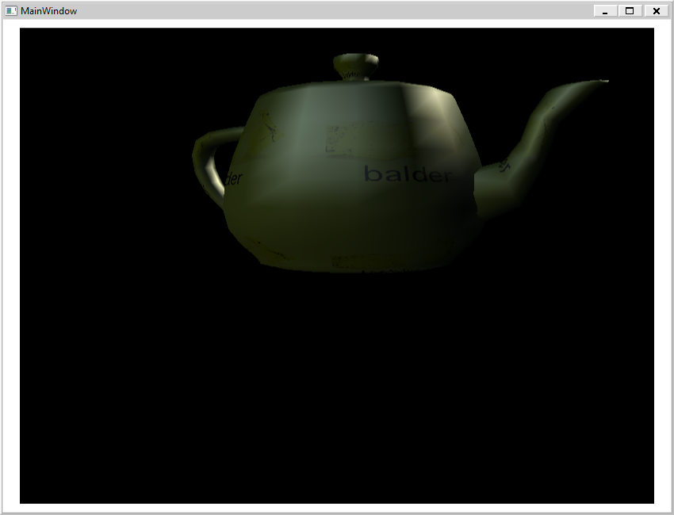

Balder is getting closer to a cross platform engine and now there is a crude implementation of WPF as well. It uses XNA for the actual rendering and you can use XAML within WPF on the desktop. Also worth mentioning is that you can use XNA directly on Windows without WPF as well inside Windows Forms.

  
For now there is no binary release, but pulling the [source](http://balder.codeplex.com/SourceControl/list/changesets) and compiling the Balder\_Wpf.sln solution in the solutions folder you'll get the binaries needed.

Summarizing the platforms supported fully or partially at this time:

- Silverlight (Full support) Windows Phone 7 (Close to full support) Windows Forms (Partial support) WPF (Partial support) iOS (iPhone/iPad) (Compiles - no graphics yet) Mono/OpenGL (Compiles - no graphics yet)
