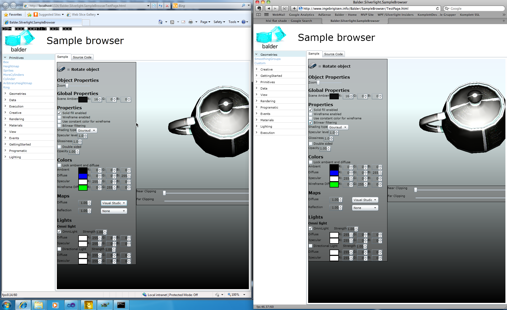

As most of you probably already know, [Balder](http://balder.codeplex.com) has thus far for Silverlight been a software rendered 3D engine. Basically what that means is that the CPU has been doing all the rendering, and not only that but also within the .net runtime. To say the least, quite costly - at least if one wants a bit of accuracy as well.

Now that the cat is out of the box and Silverlight 5 beta is available I can finally announce the new hardware accelerated support for Balder. The full feature list can be found [here](http://timheuer.com/blog/archive/2011/04/13/whats-new-in-silverlight-5-a-guide.aspx) for Silverlight 5, the beta can be downloaded [here](http://www.silverlight.net/getstarted/silverlight-5-beta/).

**Silverlight 5 Hardware accelerated 3D**

With Silverlight 5, Microsoft is introducing hardware accelerated 3D graphics. What they have basically done is take the Xna route and implement a scaled down version of Xna for Silverlight. They have implemented the basics needed to do 3D rendering, so all the asset management that Xna normally provides you with on the desktop and the Xbox is not included - here is were Balder comes into play with its support for assets.

Balder is closing in on feature and rendering parity with the Silverlight 3/4 version of Balder.

Also worth mentioning is my good friend [René Schulte](http://kodierer.blogspot.com) has a blog post up with more specific Silverlight 5 3D details [here](http://kodierer.blogspot.com/2011/04/xna-for-web-silverlight-5.html) showing the [SLARToolkit](http://slartoolkit.codeplex.com) with hardware accelerated 3D.

**Whats there**

The main priority for Balder has been to get the rendering visually equal with hardware rendering that the software rendering did, basically what that means is the lighting model that has been so far in Balder has been replicated in hardware.

Basically most of the features as you know it in Balder is supported, everything from asset management, geometries, scene management, view management, frustum clipping and all, and a hardware accelerated rendering pipeline.

The picture below shows the hardware accelerated version of Balder on the left side, and to the left is the software rendering version

****

**Whats missing**

Below you'll find a list of things that are missing :

- Sprites
- Directional lighting
- Multi texturing - reflection + diffuse maps and mixing
- Texture opacity

Over the next couple of weeks the parity gap will be closed, but also new features such as bump mapping, more asset loaders for other modelling formats and general bug fixing. Another thing is parity with Xna for the desktop and Xbox plus Windows Phone 7.

**Shaders**

Since Silverlight 5 uses Xna and graphics adapters work with the concept of shaders (vertex shaders and pixel shaders), this is also what Balder uses to do all rendering. This also means that Balder has opened up for you to actually write your own shaders but take advantage of Balders scene management, asset management and all the goodness that Balder provides, and everything done through Xaml. The shader can be specified by setting the CustomShader property on the Material object. Balder has a Shader object that you can create an instance of and point it to a PixelShader and a VertexShader.

**Demos** [Andy Beaulieu](http://www.andybeaulieu.com/) has been working with Balder and created a couple of demos that show what one can do with Balder now that the CPU is freed up to do other things. He has created a demo using physics and Balder - a video can be viewed [here](http://www.youtube.com/watch?v=VGzwJ9NnHKk&feature=player_embedded), the source for it can be found [here](http://3dphysics.codeplex.com/). Andy has a blogpost up and running [here](http://www.andybeaulieu.com/Home/tabid/67/EntryID/216/Default.aspx) with more details.

Balder has a SampleBrowser, and it is also available Silverlight 5 and can be viewed [here](/Balder/SampleBrowser/SL5/TestPage.html).

**Where do I get it?** The Balder release can be found [here](http://balder.codeplex.com/releases/view/64386). After downloading the Silverlight 5 SDK and developer runtime, you basically download the Balder release and create a new Silverlight project and add references to all the DLLs in the Balder release. The next thing you need to do is add a parameter to the plugin setup in your HTML file that holds the Silverlight plugin. You need to enable GPU acceleration :

The source code for Balder for all this will be pushed later today.

**Whats next?** Balder is an ongoing project and will continuously be developed and improved. I mentioned a few things above that will be focused on, another thing is animation. Full hierarchical animation and skeleton support and also skinning of it. Another aspect is design time support, today Balder is Xaml only - meaning that you have to type everything out. Although the API in Balder is very simple and the declarative nature of Balder is easy to use, design time support has been requested quite a few times. Another aspect is physics. The idea is to make physics a natural part of Balder by simply declaratively define properties for your objects so they can automatically take part of a physics scene without having to think much of it.
