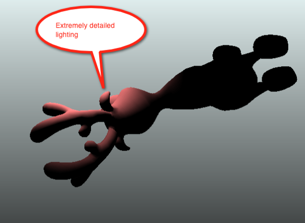

In 2007 I started something called [Balder](http://balder.codeplex.com), a 3D engine for the Web using Silverlight. Back then with Silverlight 1.1 Alpha and later 2.0, there really weren't that many options to make it especially feature rich, nor fast. My first goal when I started this whole thing was basically to achieve 3D rendering on the Web across multiple platforms (Windows + Mac, later Moonlight on Linux) and have a declarative programming model for 3D. This is still the motivation for Balder; to be cross-platform on the Web and be declarative in its nature. I've never had the idea of being a 3D engine to compete with the big engines out there that are both free and commercial, this has been partly a research project for me to learn Silverlight properly from the ground up and also maintain a foot within the graphics programming industry which I still hold dear. Even though my day to day job is something completely different these days, I've always had side projects that kept me somewhat close to what was happening in the games industry that I left behind some 10 years ago.

Back in 2007 with SL1.1 and 2.0, you basically had to either built on top of the built in primitives, which were super slow or you had to do magic like create yourself a realtime PNG encoder and draw pixels manually with code and then hand over the generated PNG to an Image control inside Silverlight.

With Silverlight 3 came along the WriteableBitmap that enabled to skip the PNG step and Balder started to pick up performance and features were a lot easier to create. This story continued through for Silverlight 4 and Balder has received many a make over of both its rendering pipeline, but also internal architecture while I've learnt more and more in-depth of how to do things in the best way inside Silverlight. With the announcement of Silverlight 5 came a long a low level interface for drawing 3D utilizing the GPU sitting inside your graphics adapter. Finally Balder could shine with great performance and still maintain its declarative, Silverlighty way of doing things.

For SL5, that was the gold-plated story - the reality is quite different. Balder needed yet another architectural make-over in order to achieve hardware rendering with Silverlight. The main problem being that rendering now had to be done on a specific rendering event that sits on a completely different thread than the regular UI thread inside Silverlight. This poses quite a few problems when Balder is built to be declarative and have all the binding capabilities that Silverlight offers.

Most of the architectural change has been done - but far from being finished. There are still some holes that needs to be filled internally in Balder that has to do with code-smell basically. At one point in time, development of Balder went forward too fast - and code-quality was during this period suppressed in favor of number of features per day that could be implemented. I know, I'm not proud, but it was the reality for the period that things needed to get done and they needed to be done fast. Another aspect of Balder development has been the lack of being able to properly test things with unit tests all the way. Quite a few times I've tried to do the effort to retrofit tests without succeeding all the way. Silverlight is basically too hard to test if you want to be lightweight with your tests. Sure, there are things out there that mock out the runtime and you can make most of your code so that you don't have dependencies to the Silverlight runtime and just run the tests on the desktop framework. I've done all the techniques out there but never been happy with the flow. This is an ongoing things.

**Are we there yet?**  
Phew.. So, were are we at?  Balder has a default branch which is still on the SL4 level where I left off over a year ago and there is a parallel branch for the SL5 parts and all the refactorings and changes that had to be done to bring Balder to SL5. There are some bugs and quirks in it and development is not going as fast as I would have hoped. There are a few reasons for that, one is the lack of tests and not a good story for retro fitting them. I've started doing it with MSpec and writing in a specification way instead, made it a lot easier but there is still a lot of work to be done there. The second reason things are going slow is that Microsoft has yet to come up with a good cross platform story for the 3D bits, in fact, thus far there is none - it only works on Windows for now. I've been probing them to get an answer, but haven't gotten one yet. To be honest, it has for a while halted my motivation for moving forward at the same pace, until last week when I had a breakthrough in rendering that increases performance quite a bit and also the quality for software rendering, which will then prove as the fallback solution for Mac.

In addition the latest versions of the most used browsers on Mac supports WebGL, which is something that can be used directly from Silverlight as well. After getting the software rendering fallback done, I'll start looking at the WebGL approach as a second fallback scenario for those browsers that supports it.

Another aspect of the SL5 codebase is that Microsoft changed security from the beta released at Mix to the version released at Build which lead to in-browser shaders not being allowed to do loops. Balder supported 5 light sources with the pixel shaders I wrote for the Beta version, but can only do one with the latest version of SL5. In order to fully support an arbitrary number of lights I'll have to move over to deferred rendering and that has quite a few implications on how Balder works as well. But a job I've started and will make it the default rendering method across the board for now.

But all that being said, there are some critical issues that needs to be solved - they are issues that really makes it hard for me as a developer to get the velocity I want, so I will be going back and forth researching and bringing back the code quality I want to feel comfortable.

**So, what about the tag-line of Balder and devices?**  
A couple of years ago I saw the opportunity to bring Balder onto more devices and started optimizing the code-base and extension points to be able to bring to things like the Windows Phone 7, iOS, Android and others. This is something I'd still love to do, but will not focus on it for quite a while. There is still too much work on the Silverlight side to justify focusing on devices just yet. There is a version of Balder for WP 7, but not for the latest Mango and to be honest, WP7 is in fact the hardest of these devices to get any proper rendering on since one is not allowed to write shaders for that device.

**Conclusion**  
As you might understand, Balder is still active - not just at the same pace as before, hoping to pick this up a little bit moving forward. There are some code-rot that needs fixing, increase of code quality and things like that holding back development a bit, but also technical challenges with the platform. Since I'm relentless with the cross-platform part and am not willing to budge on it, I will focus my energy on getting that working and hopefully working good. If this was a commercial product, I would probably not go to the lengths I am to get the cross-platform parts working, but one has to remember that my original motivation for going down the road of creating Balder in the first place was based upon cross-platform - take that out and personally I will lose the biggest motivation I've had with the project.

I've established a [Trello](http://www.trello.com) [board were people can see what I'm focusing on these days for Balder](https://trello.com/board/balder/4e95e70e82e4916636df1606).
