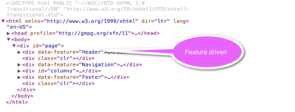

As I briefly [mentioned](/post/2012/01/14/State-of-the-union3b-2012.aspx) earlier I am endeavoring on a project which is going to demand a lot from me physically, but also from a technical perspective. I have a lot of things on my plate, during daytime I'm 100% engaged with work at clients, nighttime is the time I have to squeeze in a lot of activities into. For one, I have two kids that needs my attention - and I have a golden rule of engaging with them from the time I get back from work till they're in bed. This leaves some 2-4 hours left per day to do all the things I do. I therefor have to be smart with my time and make the most of it. Adding things into the schedule is hard and if I add something, it in general must have a synergy with something already in my schedule. In my schedule I have a couple of open-source projects that I focus a lot of my energy on; [Balder](http://balder.codeplex.com), [Bifrost](http://github.com/dolittlestudios/bifrost) and [Forseti](http://github.com/dolittlestudios/forseti), so pretty much anything I put in must relate to these in some fashion. Geekrider arose concretely from this need of synergy. I need to focus more on physical exercise and brought in Geekrider with the synergy of pushing forward development on the open-source projects I'm involved in forward. [Balder](http://balder.codeplex.com) will hopefully serve the purpose of 3D visualization and bringing forward the a few features that I want to have in that project. As a general web platform, I could have gone for anything already out there, but I wanted to push forward features in [Bifrost](http://github.com/dolittlestudios/bifrost), I therefor decided to build the site from scratch on top of it and also push into the cloud by hosting it on [AppHarbor](http://www.appharbor.com). Since the site will become very JavaScript intensive, and I pretty much get allergic reactions when I don't write tests or BDD style specifications for my code, the last project also will get some love; [Forseti](http://github.com/dolittlestudios/forseti). The reasoning behind the project is that most test runners out there has so many moving parts in the form of dependencies to get up and running and they're also very focused on running things in a browser. [Forseti](http://github.com/dolittlestudios/forseti) is aiming towards something very different, a headless runner for JavaScript tests based on [Env.js](http://www.envjs.com/) not using by default any browsers to execute the tests/specs.

One of the goals for [Bifrost](http://github.com/dolittlestudios/bifrost) is to make it easier for developers to create rich web based applications, promoting good software development practices. Today, the RIA space is rapidly changing and for the most part moving away from plugin technologies such as Flash or Silverlight and focusing more on the open standards found in HTML, CSS and JavaScript/EcmaScript.

From a fronted development perspective, [Bifrost](http://github.com/dolittlestudios/bifrost) is taking on this latter part. Traditionally one would compose the resulting web page that is handed over to the client on the server. Multiple solutions exist out there for doing so, and specifically in the .net space, ASP.net and its derivatives are the most popular ones. Rendering, as this is often referred to, adds an extra load onto the server - not only is the server responsible for dealing with the request from the user, wether it is getting data or performing an action, but it also has to transform the result into something the client can show. On top of all this, it has to deal with security. This pattern is a very proven pattern, but in my opinion not the pattern we want to be doing moving forward, and therefor [Bifrost](http://github.com/dolittlestudios/bifrost) will focus on a different pattern. Sure, Bifrost will not only be compatible, but also support out of the box the traditional route - but for now in an opinionated fashion by only supporting ASP.net MVC. The technique that [Bifrost](http://github.com/dolittlestudios/bifrost) will be focusing in on is the [Single Page Applications](http://en.wikipedia.org/wiki/Single-page_application), were you basically hand over the "rendering" to the client and let the client compose the page by swapping in and out elements at runtime. This is in fact nothing new, ever since AJAX became the big thing, we've pretty much been doing this - but only for parts at a time and even letting parts of our page be swapped out for new versions being rendered by the server dynamically.

[Bifrost](http://github.com/dolittlestudios/bifrost) will have a composition technique that is based on, as most things in the framework, conventions. The focus will be on Features and one can point to a feature simply by adding a **
** tag and give it the attribute **data-feature="\[name of feature\]"**. Based on the configurable convention, [Bifrost](http://github.com/dolittlestudios/bifrost) will find the necessary files representing the feature. Looking at the page from Geekrider as it is at the time of writing this post, we'll have the following.

So, back on track. Now that we have this, what is the next logical step?  Up till now, [Bifrost](http://github.com/dolittlestudios/bifrost) has been very server side rendering focused, sporting an extension for ASP.net MVC and taking advantage of that stack. That is about to change, or should I say, the fact that it has been the only way to use [Bifrost](http://github.com/dolittlestudios/bifrost) is about to change. A set of REST endpoints will be exposed from [Bifrost](http://github.com/dolittlestudios/bifrost), enabling any client to interact with the framework. From a Web developer perspective, this is not good enough, we're therefor working on bringing in a JavaScript library that will just nicely integrate with all this.

In addition to the goals summarized thus far, I've also got another goal for me personally; I want to become more productive with tools other than what I'm used to. I recently bought a MacBook Air, an impressive piece of hardware - but it doesn't sport the same specs as my MacBook Pro or my iMac, I've therefor decided not to put any virtualization software on it to run Windows. This means I have to start using other tools than Microsofts Visual Studio for my development. For .net development, I'm for now using MonoDevelop and for general HTML, JavaScript and CSS development, I'm using TextMate. My long term goal is to be using TextMate for everything.

Summarizing, Geekrider will be the proof of concept for features added to [Balder](http://balder.codeplex.com) and [Bifrost](http://github.com/dolittlestudios/bifrost) - driving forward with new thoughts and ideas. I will try to blog about the progress as much as my schedule can permit. This means I should keep myself from [playing](http://hu.partypoker.com/) around or doing unnecessary stuff.
