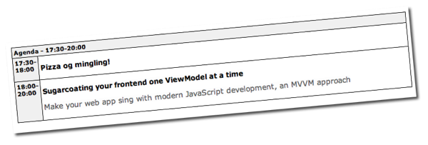

On the 29th of February, [Pavneet Singh Saund](http://pavsaund.wordpress.com) and myself will be holding a talk about modern web development for [NNUG Vestfold](http://nnug.no/Avdelinger/Vestfold/Moter/NNUG-Vestfold---22-Februar-2012/).

For years, for a lot of developers, the Web has been a mess and JavaScript has not made that mess any better. There has been a lot of improvement over the years and a lot of efforts in bringing structure as well as promoting JavaScript into a first class citizen of your every day application development. The topic of the talk will be around this, how can you as a developer work with JavaScript and stop having the feeling that it is just something you have to do, but don't like to do.

Here's the agenda.  

Don't hesitate to [register](http://nnug.no/Avdelinger/Vestfold/Moter/NNUG-Vestfold---22-Februar-2012/), this will be great fun!
