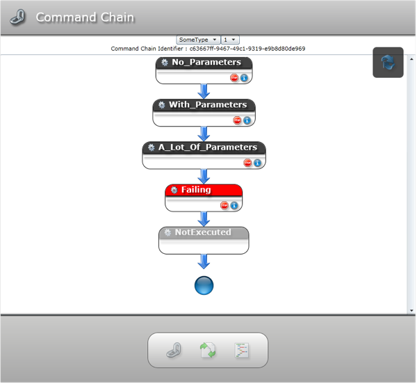
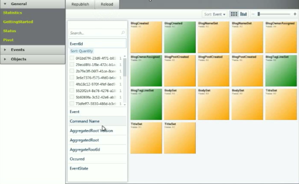

Every now and then in a software career you get a chance to write something from scratch and try out new things; a proper greenfield project. I've had that luck a couple of times and latest a project that proved to be the complete game-changer for me personally. Game changer in the sense that I gained a knowledge that I am pretty sure I will treasure for, if not the rest of my career, at least for quite a few years moving forward. The knowledge I am talking about can be linked back to applying [CQRS](http://en.wikipedia.org/wiki/CQRS), but it is not [CQRS](http://en.wikipedia.org/wiki/CQRS) in itself that is the knowledge, its the concepts that tag along with it and the gained knowledge of how one can write code that is maintainable in the long run. Its also about the things we discovered during the project, smart ways to work, smart code we wrote - techniques we applied in order to meet requirements, add the needed business value, and at the same time deliver on time with more than was asked for.  

This is a more in-depth post than the [talk I did @ NDC 2011](https://vimeo.com/45594255)

# … from the top ...

For the last couple of years, till March this year, I had the pleasure of being hired by [Komplett Group](http://www.komplett.com), the largest e-commerce in Norway. At first I was assigned tasks to maintain the existing solution and was part of the on-premise team to do just that. As a consultant, that is very often what you find yourself doing - unless you're hired in to be a particular role, like I've been in the past; system architect. I helped establish some basic architectural principles at that time, applying a few principles, like IOC and other parts of our favorite acronym; S.O.L.I.D. I remember feeling a bit at awe of just being there, they had a solution that could pretty much take on any number of clients and still be snappy and they never went down. I've learned to respect systems like that, even though it requires a lot of work - not necessarily development work, but a lot of the time IT or DevOps help keep systems alive. Anyhow, after a few months, back in 2009 I was asked by the department manager if I wanted to lead a small team on a particular project, an administration-tool for editing order details. With my background earlier as a team lead and also as a department manager myself, I kinda missed that role a bit and jumped at it. It was to be a stand-alone tool, accessible from the other tools they had, but we were given pretty much carte-blanche when it came to how we did it, whatever technology within the .net space we wanted. We settled on applying ASP.net MVC, Silverlight for some parts, WCF for exposing service for the Silverlight parts and nHibernate at the heart as the ORM for our domain. 

Part of the project was also to try out Scrum, having had quite a bit of experience with everything ranging from eXtreme Programming to MSF Agile and later Scrum, that excited me as well. So we applied it as well. 

Half-way through the project we started having problems, our domain was the one thing we shared with the others and we started running into nightmare after nightmare because we worked under the one-model-to-rule-them all idea. Which is really hard to actually get to work properly, and looking back I realize that most projects I've been have suffered from this. We ran into issues were for our purpose we needed some things in \*-to-many to be eager fetched, which had consequences we could not anticipate in other systems that was using the same model. But we managed to come up with compromises that both systems could live with - still, we weren't seeing eureka, just brushing up against the problems that a lot of projects meet without seeing that the approach was wrong. A bit after this we started brushing up against something that really got us excited; Commands. Without really knowing about CQRS at this point, but more coming from working with Silverlight and WPF, the concept of modeling behavior through commands. The reason we needed these commands was that we needed to perform actions on objects over a long period of time; potentially days, and at the end commit the changes. We came up with something we called a CommandChain - a chain of commands that we appended to and persisted. Commands represented behavior and modified state for the most part on entities when executed. We came up with a tool were we could debug these chains, and we could inspect which Command was causing problems and not.

All in all, we were quite pleased with the project; we had done a lot of new things, applied TDD in a behavioral style, started exploring new corners of the universe we had yet to realize the extent of. Delivered not too badly on time, not perfectly on time - but close enough.

# The turning point

After yet another 6 months or so, there were initial talks about the need to expose functionality from the web-shop to other systems used internally, a few design meetings and meetings with management lead to a new project. The scope of the project turned out to be not only exposing some services, but also a new web-shop frontend targeted and optimized for smartphone devices. The project was initiated from a technical perspective and not one with a specific business need in mind. From a technical perspective, the existing codebase had reached a point were it was hard to maintain and something new needed to replace it to gain back velocity and control over the software. It was to be a complete greenfield project, totally throw things overboard and just basically work with existing database but add flexibility enough that even that could be thrown out the door, if one ever wanted to do that. Early on I was vocal about them needing an architect to be able to deliver this project, I pointed in a couple of directions to internal resources they had - but people pointed back to me and I soon found myself as the system architect for the project. 

# Requirements

When dealing with e-commerce at this level, there are quite a few challenges. Lets look at a few numbers; in the product catalog there was at the time I got off the project about 13.000 products, there was an order shipped every 21 seconds, in 2011 that amounted up to 1.454.776 orders, ~30.000 living sessions at any given time. Sure, its not [Amazon](http://www.amazon.com), but for our neck of the woods its substantial. These numbers are of course on an average, but come busy times like Christmas, these numbers are more focused and the pressure is really on for that period in particular.

# Decisions, decisions, decisions...

Before we started production, back in November 2010, we needed to get a few things straight; architecture, core values for the project, process and then getting everyone on-board with the decisions. We early on decided that we were going to learn all about CQRS, as it seemed to fit nicely with the requirements - especially for performance, and we were also requiring ourself that we wanted a rich domain model that really expressed all aspects of the system.  We also decided that we wanted to drive it all out applying [BDD](http://en.wikipedia.org/wiki/Behavior_Driven_Development), and we wanted to be driving the project forward using Scrum and really be true to the process, not make our own version of Scrum. A dedicated product owner was assigned to the project that would have the responsibility for the backlog, make sure that we refined as needed, planned as needed and executed on it. 

# Adding the business value

As I mentioned, this project came out of a technical need, not a concrete business need. We had the product owner role in place and he needed to fill the backlog with concrete business value. This was not an easy task to do, basically because the organization as a whole probably didn't see the need for the project. In their defense, they had a perfectly fine solution today, not entirely optimal for smaller screens like a smartphone, but manageable. To the different store owners that normally provided the needs to the backlog, they were in desperate need of new features on existing solution, rather than this new thing targeting a platform they didn't see much business value in adding. In combination with the fact that the organization had been in migration mode and all developer resources partly or close to full-time in periods being tied down to work related to migration of systems that was a result of merges and acquisitions, the organization had gotten used to not getting things done anyways. All this didn't exactly create the most optimal environment for getting the real business value into the project. Something we really wanted. Early on we realized that the project could not be realized if we had user stories that were technical in nature. The first couple of months we did have quite a few technical user stories, and statistically these failed on estimation. We didn't have any business value to relate them directly back to, and ended up in many cases as over-engineering and way out of their proportions as we as developers got creative and failed at doing our job; add business value. So we came to the conclusion; no technical user stories were allowed - ever. Something that I still today think was one of the wisest decisions we had on the project. It helped us get back and focus on why we were writing code every day; add business value. Even though this project was a spawn of the developers, there was clearly business value to guide us through. The approach became; lets pretend we're writing an e-commerce solution for the first time. This turned out to be a good decision, it helped us  be naïve in our implementations - keeping in line with core principles of agile processes; the simplest thing that could possibly work. Our product owner was then left with the challenge of dragging the business value out of the business, he did a great job in doing that and at the same time getting them to realize the need for the change of platform that was in reality taking place. Something that became evident further down the line; we were in fact not building an e-commerce front-end for smartphones, but an entire new platform. More on that later.

# YES, we did create a framework

One of the realizations we had early on was that we needed to standardize quite a few things. If you're going to do that many new things and have a half-way chance of getting everyone with you and feel productive in the new environment, you need to get a basis working that people can work with. Back in 2008 I started a project called [Bifrost](http://bifrost.dolittle.com), you can read more [here](http://ingebrigtsen.blog/post/2012/06/05/Philosophy-of-Bifrost.aspx). We looked at it and decided it was a good starting point for what we wanted to achieve. We also wanted the framework to be open-sourced. The philosophy was to create a generic framework to be the infrastructure sitting at the core of the application we were building. It would abstract away all the nitty gritty details of any underlying infrastructure, but also serve as the framework that promoted CQRS and the practices that we wanted. It was to be a framework that guided and assisted you, and very clearly not in your way. I'm not going to go in-depth in the framework, as there are more posts related to it specifically in the making and already out there.

# CRUDing our way through CQRS

Well on our way, we had quite a few things we really couldn't wrap our heads around. Coming from a very CRUD centric world, the thought of decoupling things in the way that CQRS was saying was really hard. And at the same time, there were potential for duplication in the code. I remember being completely freaked out at the beginning of the project. All my neural cells were screaming "NO! STOP!" - but we had to move on and get smarter, get passed the hurdles, learn. At first we really started making a mess out of things, just because we were building it on assumptions - the assumptions that CQRS is similar to doing regular old CRUD with what we used to know as a domain model. It was far from it, and we had a true eureka at one point were we realized something important; we were working hard an entire day on how to represent some queries in a good way so that they would be optimal in the code but also execute optimally - and it hit us as a ton of brick after leaving work that day. We were doing everything wrong, and we even came up with a mantra; "if a problem seems complicated, chances are we're doing it wrong". That was the turning point that helped us write code that was simpler, more testable, more focused, faster and we picked up pace in the project like I've never experienced before. 

From that point we had our mantra that really proved as a guiding star. Whenever we ran into things we didn't have an answer to straight away and we started finding advanced solutions to the challenges, we applied the mantra and went back to rethink things.  

# Tooling

Early in the project we realized we needed a tool for both visualizing the events being generated, but also be able to republish events. We came up with a tool built in Silverlight, using the pivot control from Microsoft to visualize.

# The real benefits

Looking back at what we did and trying to find the concrete benefits, I must say we now have gained serious amount of knowledge in a few areas. The thing that CQRS specifically gave us was the ability to model our domain properly. We achieved the separation we wanted between the behavior of the application and the things the behaviors caused changes to, the data on the other side. It helped us achieve greater flexibility, easier maintenance. Since we decided to not only just apply CQRS, but also build a reusable framework sitting at the bottom, we achieved a certain pattern of working that made things really easy to get started with development, and also a recognizable structure that made it easy to know were to put things if the core principles was explained to you.

I think by far the biggest benefit we achieved was the insight into how we should be developing software. Keeping things simple really have huge benefits. Decouple things, staying true to single-responsibility in every sense of the word **single**.

Another huge realization I had, something I have been saying all the time throughout my career but really got re-enforced with this project; concrete technology doesn't really matter. Sure things will end up as a certain concrete technology - but stop thinking concretely when designing the system. Try to get down to the actual business needs, model it and let the concrete technology fall into place later. With this approach, you gain another useful possibility; doing top-down development. Start with the user interface, move your way down. Keep the feedback loop as tight as possible with the business. Don't do more than is needed. This approach is something I know I will be missing the most in future projects. A tight feedback-loop is were the gold is hidden.

# Were did we screw up?

This project must come across as a fairly peachy story. And sure, it was by far in my experience the project with the best code-base, the most structured one, the one that I personally learned the most from and also the one project in my career that we really managed to be on schedule and in fact for a couple of the releases we delivered more business value than was asked for. But it came at a price. One of the things we struggled with early on was to spread the knowledge across to the entire team and get everyone excited about the architecture, the new way of working with things and so forth. Personally I didn't realize how invested people were in their existing solution, and also in the existing way of doing things. Me as the architect, should have seen this before we got started. The problem with not realizing this ended up being a growing problem in the group. You had a divide in the group of people buying into the entire story and those who didn't or didn't quite get the entire story. My theory is that we should have given the most invested members of the group a time for mourning. Get time to bury their friend through many years; the old project. We should have realized that we were in fact building for the future and would replace the existing solution at the beginning of the project and this should have been the official line. Instead it kind of organically became the official line. We did at the beginning do training in all the new techniques, and gave people time to learn. Basically didn't give them any tasks for a few weeks and just pointed them in the general direction of things they should look at. What I think we failed on was that we didn't point out that these things were not optional, these new ideas were in fact mandatory knowledge. We should have been much clearer about this and been vocal about the expectations. Another thing I think I would have done a bit different; involve more people in the framework part of things. With the risk of stepping on toes, I think it is not wrong of me to say that I was the framework guy. For the most part, I ended up working on the framework. Don't get me wrong, I love doing that kind of work - but I think the experience, the design decisions got lost in translation and not everyone in the group understood why things were done as they were. 

# Conclusion

The project and opportunity that was given to the team was awesome, I really appreciate the trust that was given to me for leading the way in this project. The pace we had, the stuff we did has so far amounted up to be the coolest project I've ever worked on - and I am happy to admit it; I miss the project. Hadn't it been for a great opportunity that was given to me, I would have loved to stay on further. We had ups and downs, as with any software project, but overall I am wildly impressed with our accomplishments as a team and also by the end result.

Ohh… By the way. The end result can be found [here](http://m.komplett.no).
