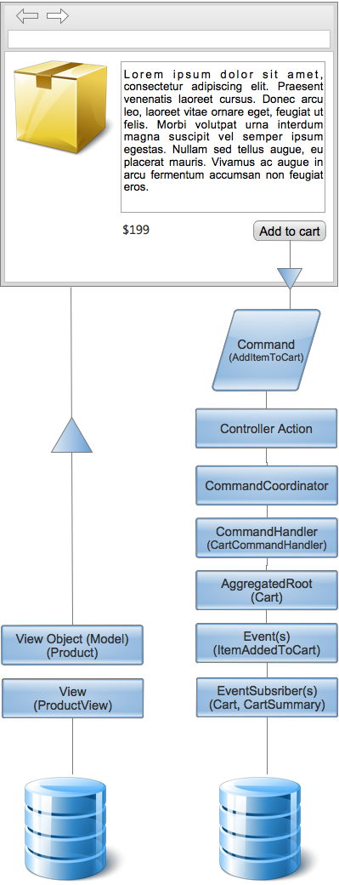
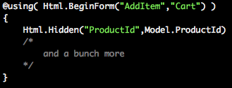
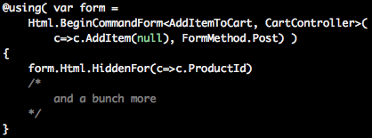
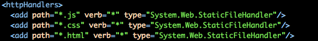
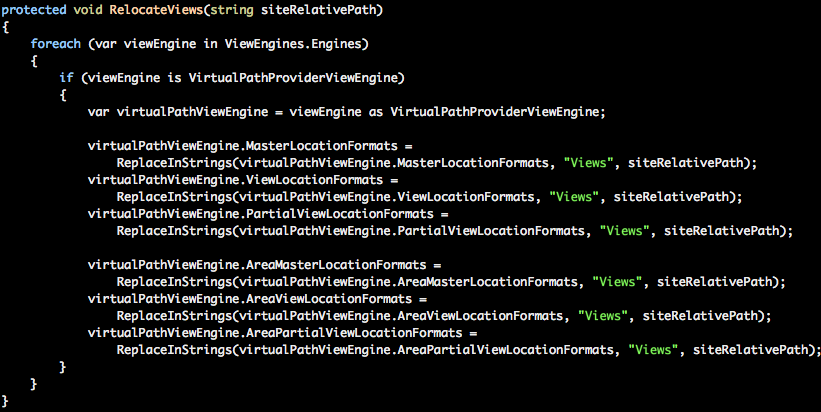

If you're in the .net space and you're doing web development, chances are you're on the ASP.net stack and you might even be using the MVC platform from Microsoft on top of it. When we started building Bifrost for the [initial project](http://ingebrigtsen.blog/2012/07/12/cqrs-applied-a-summary/) we needed it for, we were also on the ASP.net MVC stack and quickly realised we needed to build something for the frontend part of the application to be able to facilitate the underlying backend built around the [CQRS](http://en.wikipedia.org/wiki/CQRS) principles. This post will talk a little bit about the motivation, what we were trying to solve and what we came up with.

# The Flow

Below you see a sample of a flow in the application. This particular sample shows a product page, it has details about the product and the price of course and what not, but also a simple button saying "Add to cart" - basically you want to add the product to your shopping cart.

# 

Sure enough, it is possible to solve this without anything special - you have your Model that represents the product with the details, price being a complex thing that we need to figure out depending on wether or not you have configured to show VAT or not and also if you're part of a price list - but something that is relatively easy to solve. On the execution side we have a command called AddItemToCart that we can with a simple ASP.net MVC form actually get populated properly :

A regular MvcForm with hidden input elements for the properties on the command you need that are not visibles, and of course any input from the user are regular input fields, such as text boxes and others. Basically, by setting the correct name, the default model binder in ASP.net MVC should be able to deserialize the FORM into a command.

# Validation

Now here comes the real issues with the above mentioned approach; validation. Validation is tied into the model, you can use any provider you want, the built in one or things like [FluentValidation](http://fluentvalidation.codeplex.com), like we settled on. But you quickly run into trouble with client-side validation. This is basically because the view is identifying one model, but the things you really want to validate are the commands. You want to validate before commands are executed, basically because after they are handled and events are published - the truth has been written and its too late to validate anything coming back on any models. So, how can one fix this? You could come up with an elaborate ModelBinder model that basically modified model state and what not, but seems to be very complicated, at least we thought so, of course after trying it out. We came up with something we call a CommandForm - so basically, instead of doing BeginForm() as above, we have extensions for the HtmlHelper that creates a CommandForm that gives you a new model within the using scope that gives you all the MVC goodies in a limited scope, including the ability to do client-side validation.

So now you get the following :

Now you get a form that contains a new HtmlHelper for the command type given in the first generic parameter, and within the form you'll also find the Command, if you need to set values on it before you add a hidden field.

This now gives you a model context within a view that is isolated and you can post that form alone without having to think about the model defined for the view, which really should a read only model anyways.

Worth mentioning is that there is also an AJAX version of the same BeginCommandForm() were you do Ajax.BeginCommandForm() for those who need that as well.

# Features

Another thing that we wanted to do, as I mentioned in [this](http://ingebrigtsen.blog/2012/07/22/cqrs-the-awakening/) post, was the isolation of Features - sort of applications within the applications, just part of the overall composition that composed the larger scope. We defined a feature to contain all the artefacts that build up a feature, the view, controller, any javascript, any CSS files, images, everything. We isolate them by having it all close to each other in a folder or namespace for the tier you're working on, so for the frontend we had a Features folder at the root of the ASP.net MVC site and within it every feature was sitting there in their own folder with their respective artefacts. Then moving down to the backend we reflected the structure in every component, for instance we had a Component called Domain, within it you'd find the same structure. This way all the developers would know exactly were to go and do work, it just makes things a lot simpler. Anyways, in order to be able to accomplish this, one needs to do a couple of things. The first thing you need to do is just collapse the structure that the MVC templates creates for your project so that you don't have the Controllers, Views and Models folders but a Features folder with the Web.config from the Views folder sitting in it at its root.

Then we need to handle static content property in the Features folder by permitting things like javascript files sitting alongside the view files, so you need to add the following within the <System.Web> tag in your Web.config file :

Then you need to relocate the views master location formats for the view engines in ASP.net MVC :

(Can be found [here](https://github.com/dolittle/Bifrost/blob/master/Source/Bifrost.Web.Mvc/BifrostHttpApplication.cs))

It will then find all your views in the features folder. You should now have a new structure. Only drawback, if you see it as one, is that tooling like Visual Studios built in "Add View" in the context menus and such stop functioning, but I would argue that the developer productivity is gained through a proper structure and you really don't miss it that much. I guess you can get this back somehow with tools like Resharper, but personally I didn't bother.

# Conclusion

ASP.net MVC provides a lot of goodness when it comes to doing things with great separation in the Web space for .net developers. It also provides quite a few extension points, and you can really see that the developers at Microsoft that has been working on it has gone out of there way to make it extensible and make the code clean. Sure, its not perfect, but what is - its way better than anything we've seen. This is something that we enjoyed quite a bit in our own little CQRS Journey, we did try quite a few things, some of them worked out fine - like the CommandForm, and some didn't. But we were quite happy with the productivity gain we got by adding these helpers, and it also made things a lot more explicit.

One conclusion that we did however reach at a point, ASP.net MVC and Bifrost and its interpretation of CQRS is a bit of a strange fit. We basically have a full pipeline, in quite a different manner than ASP.net MVC has - which is a focused frontend pipeline. So any security, validation and more is something that we started building into Bifrost and the need for ASP.net MVC became less and less important, and when we started down the journey of creating Single Page Applications with HTML and JavaScript as the only thing you need, you really don't need it. The connection between the client and server would then be with Web requests and JSON and you need something like WebApi or similar, in fact we created our own simple thing in Bifrost to accommodate that even. But all this is for another post.

The MVC part of Bifrost can be found [here](https://github.com/dolittle/Bifrost/tree/master/Source/Bifrost.Web.Mvc), and Bifrosts official page is under construction [here](http://bifr.st) and the source [here](https://github.com/dolittle/Bifrost).
