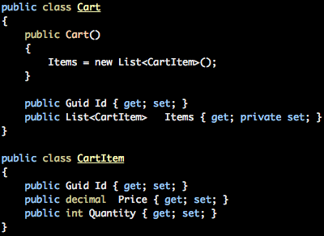
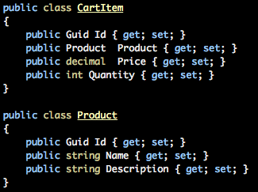
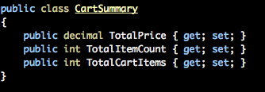

Ever have that feeling when all of a sudden you're completely getting something, like an [awakening](http://www.imdb.com/title/tt0099077/). You might have been doing something that you think you were doing right, but all of sudden you get this eureka moment that not only tells you that you're doing things wrong, but also raises your awareness to a whole new level. This is what we experienced on the [first project were we applied CQRS](http://ingebrigtsen.blog/2012/07/12/cqrs-applied-a-summary/). In fact we had quite a few of these moments, this post is about trying to describe what we went through.

# The background

Before we can start, I think it is important to give a bit of a background of what we were used to be doing. Like most people in the development community, we tried following the right people on Twitter, read blogs, read books and in general just try to keep up the pace and learn new things. Some of us had really fallen in love over the years with the concept of [TDD](http://en.wikipedia.org/wiki/Test-driven_development), [BDD](http://en.wikipedia.org/wiki/Behavior_Driven_Development), clean code, [agile](http://en.wikipedia.org/wiki/Agile_software_development), [domain driven design](http://en.wikipedia.org/wiki/Domain_driven_design), the [S.O.L.I.D](http://en.wikipedia.org/wiki/SOLID_(object-oriented_design)) principles and what not. We tried to write our software according to the principles we loved. We were pretty convinced we were doing a great job at it as well. Even though we felt at times there were something wrong with a few things, we carried on.

The way we used to do things was to basically have a relational database sitting at the core with pretty much just tables and relations and the odd view every now and then. On top of that we would model objects that represented those tables and relationships and we would add more business logic to these objects and we would then slam a stamp on these objects and call them our domain model. This domain model would only have one representation of every type, so that we [didn't have to repeat ourself](http://en.wikipedia.org/wiki/DRY). From this we modeled repositories that enabled us to work with getting the domain objects, change them, update them and every now and then we needed to delete them; good old [CRUD](http://en.wikipedia.org/wiki/Create,_read,_update_and_delete) operations. We would even throw in some services to explicitly model functionality that was outside the responsibility of the repository, but more to capture business logic that was more involved. From my experience working in different projects and what I've seen doing consultancy, this is not way off what people tend to do. Of course there is more to it, you have your factories, your managers and what not, and you might even have different representations of your domain model for the view were you need to map back and forth between the different layers. Sure. More involved, but you get the picture.

# Relationships

Often you find yourself writing these relationships between things, and it is just so logical that there is a certain relation between the two entities - they belong together in a symbiosis somehow. Take for instance a shopping cart, it is just sitting there screaming for content in the form of some items, there is no other way around it. We just get a craving for amodel similar to this : 

Looks innocent enough and really makes sense. You might even throw in some read only properties that gives you convenience for counting the number of items, summarizing all the items and so forth. And then you realize, hang on - that CartItem is not referring to any product. 

So now we have first of all a One-To-Many relationship, then we have a One-To-One relationship. Whenever we want to just check how many items we have in our cart we have to pull in this entire thing. Wait you might be saying now, with modern [ORM](http://en.wikipedia.org/wiki/Object-relational_mapping) we can specify how it is supposed to fetch things, by demand - typically what is referred to as lazy loading. Sure, we could do that for Product, and probably also for the CartItem, but the second you would ask for something like quantity it would still need to fetch all the CartItems. This adds quite a bit of complexity to your solution. All of a sudden you have a situation were your application is governed by how the objects are configured for the ORM and how they should be fetched. Potentially you could end up with 3 round-trips to the database if the model is used in a particular part of your Cart visualization that is showing the product names. Ones for getting the Cart from the database, ones for getting the cart items it is enumerating, and once for getting the product. What happens if we throw price into the mix. The product can't have a price directly, because there might be discounts that is relevant for the customer, so yet another object just to display something that seems very simple and straightforward.

Now you might be saying, why don't we just flatten this all out in a database view - my response to that; exactly. That is exactly what we should be doing, but not in the database. This is at the core of the benefits CQRS can give you; the ability to flatten things out - especially if you buy into the [EventSourcing](http://codebetter.com/gregyoung/2010/02/16/cqrs-task-based-uis-event-sourcing-agh/) story, storing state as a series of fine grained events. Sure, you don't need EventSourcing, but it adds for greater flexibility when you want to fully take advantage of the ability to flatten things out after something has already happened. More on this in a bit.

So views and flattening things out. That was our first moment of clarity. We really didn't need any relationships, in fact we didn't even need a Cart object, we needed something called CartSummary - it was a very different beast. And so much simpler in its nature.

 

So what happened here?

Instead of having to go to the database and get all those details as mentioned earlier every time we wanted to get to the summary, we had this simple object. Whenever the user performed an action that said add something to the cart, or remove something from the cart, we would have 2 subscribers for these events. One subscriber would be in charge of updating the underlying CartItem, and another one would be in charge of updating the CartSummary by selecting into the CartItems and just setting the values accordingly. Instead of taking the hit every time you needed the detail, we now take the hit only when actions are performed. My claim is that most applications out there has a ratio between reads and executes that are probably around 9 to 1, so why haven't we been optimizing for this scenario before? 

Anyways, clearly the objects became simpler and more focused - all of a sudden our objects were doing one thing, and one thing only. We were empowered with the ability to really apply the [single responsibility principle](http://en.wikipedia.org/wiki/Single_responsibility_principle) for our objects.

I mentioned EventSourcing; a technique for storing the events sequentially as they happen so that we can replay them at any given point in time. This is a very powerful tool. Imagine the flattening we just did and lets say you want to keep introduce another object to the mix and you want the historic state to affect that object. With event sourcing it is then just a matter of replaying those events for the event subscribers dealing with the new object and all of a sudden you have your new optimized state. An example of that could in the cart context be something like a realtime report showing all the carts historically aggregated, you could have objects representing only living carts - and more. The best part, these objects are lightweight and you start seeing possibilities for storing these in a very different manner.

# Concepts

One of the things we started also realizing was that we were having a lot of IDs as a consequence hanging around, either as integers representing the identity or GUIDs. Neither our Commands nor our Events were reflecting properties on them very well. A standard value type sitting there didn't say what it was, it was basically just an integer or a GUID. So we started modeling these things that we ended up calling Concepts. These were cross cutting and something we kept in its own project that could be reused all through. It turned out to be the one thing that was shared between things. The types we introduced were basic reusable things, like StoreId, representing a Store, but also more complex things like a PhoneNumber instead of holding a string. EMailAddress is another example of just that and all of a sudden it was so much easier to model all aspects of the system and we got ourself a vocabulary - one of the key elements of domain driven design. You couldn't go wrong. Another benefit we got from this, purely technically, was that validation was all of a sudden falling into place as the cross-cutting-concern it is. Along side some of these concepts we put validators, we used FluentValidation for this as it let us put validation outside of the thing we were validating, giving us great flexibility in how we applied validation - a whole concept for a different post that I'm hoping to get to; discovery mechanisms based on configurable conventions and hierarchies. Anyhow, with having the concepts and validation of concepts we got DRY in what we consider a very good way. 

# LINQ madness

Once you learn something and you really like it, it is hard to change how you do things. This was something we ran into quite a bit, but one incident that comes to mind was specifically tied into LINQ. We had our Cart and CartItems and just wanted to model the CartSummary, but wanted to solve it through querying. Basically we wanted to be able to specify for an object like that how it could aggregate things, totally disregarding that our platform could at this point flatten things out when things changed, not having to aggregate every time. We had a full day of bending things around LINQ and we wanted add some business rules to some of our objects we used in the view to change the outcome. To do this, we wanted to specify things using the [specification pattern](http://en.wikipedia.org/wiki/Specification_pattern) and turn it into LINQ expressions that we could execute against the datasource. Sure, it might have seemed as a good idea if you didn't have CQRS in mind. But we did have CQRS and we wanted to be pure. At this point I remember having a feeling that we were just creating a really fancy ORM - and not really doing anything differently, rather just massively overkilling our existing ways of doing things. This day we discovered that it is not really about querying - the Q in CQRS is not about querying. We went back, changed our code so that we flattened things when events were risen. We could then just access everything by keys and that would be it. And this concept can go all the way for just about everything. As long as you have a key, you can go get things. This realization led to us not calling things queries - we changed it to be called view, lacking a better name. But at least it was closer to what things were, we weren't going to execute complex queries - but get things by a key.

# GUID is the key 

In order for CQRS to be applied, you need to start thinking very differently about how your objects gets their identification assigned. In our opinion; its all about being able to generate the Id already from the client. By doing that, things get so much easier. All of a sudden the client knows the identity of the thing it is creating, meaning that it can already at that point, even though it might not be ready due to eventual consistency, use the Id for other purposes related to it. Basically, we can start doing a few assumptions in the client and create better user experiences. We used a [GUID](http://en.wikipedia.org/wiki/GUID) throughout the system for everything that was used to identify items. 

# Data, what data...

One of the things that we're thought when working with more classic approaches like explained earlier, is to be very data focused. We're modeling the data and then we're creating, updating and deleting it. We're thought to work with state. When you sit down with a user and ask them to describe to you their needs in the application you're building for her. Unless she is a power user tainted by developers, she will probably state her needs as behaviors. How often have you heard the "I need a button here, so that…", and we immediately stop paying attention because we're so annoyed that the user couldn't speak in more abstract terms than concretely about the button and we only pick up the stuff that comes after "so that" which is the state bit. Creating software is not about building state, its about exposing behaviors to the user that might end up as state. This is a very core principle in CQRS; Commands. You model your commands to expose the behavior that is needed and you also capture the intent. With a command you represent the What and potentially the Why - you put it in the name of the Command : ChangeAddressBecauseOfMove - now we have the What and the Why. 

This is something we realized more and more throughout the project - it is really all about the behaviors, once we got to that, it was so much easier picking up what the users wanted from the system. All of a sudden the button that the user wanted is not that much of a problematic way of expressing the needs, especially when you start doing things top-down and you can actually work with the user on prototypes, drawings and similar - things that they relate to. A user do not relate to a SQL table or relationship, they relate to the things they do - like clicking a button. 

From this realization came a bunch of other eurekas throughout the project. The biggest and most important thing was that we should step away from the idea that state can only be held in one place. Lets face it, a SQL server is good at many things but not everything, just like any technology; nothing is great at everything. We started realizing that we could start persisting our state that would be most suitable for its use. For one particular feature we put the data as a JSON object model directly onto a CDN and let the client download it when the feature was loaded. With GZIP compression on the server that request turned out to be on an average of 40KB and totally taking the load away from the Web server and the SQL server for performing something that would have been a pretty complex query. Instead we generated the JSON file whenever the underlying data changed, and it was not changed very often - so browser caching would also be a big benefit for returning customers.

We started realizing that we could pretty much go any way with this. A lot of the time, things are close to static - they hardly change. Why are we then dynamically generating things like Web pages - why aren't we just generating them when things change and put them on a CDN or on the file system of the Web server that hosts the solution and we just sent it directly back to the client. You might be saying at this point that we do have things like caching of web pages for things like this, but I would argue - why would you add that complexity to your solution, why would you also add that pressure onto your hardware in the terms of extra memory needed, for all of your servers in the farm to be able to process this. All that for something that is solved way easier, just render it when needed. 

With all this, we stopped thinking about data - we focused on the behavior, the data - or state as I would rather prefer to call it, could then be represented in any way, in fact - it might even change over time how you represent it.

# The bounded contexts

One of the things that [Eric Evans](http://domaindrivendesign.org/about) mentioned in [his book on DDD](http://domaindrivendesign.org/books/evans_2003) is the concept of bounded contexts. A concept that is in a bit of conflict with the idea of DRYing up things and the whole idea of having one model to rule them all. The idea is to have context aware representations of concepts found in your domain. Take for instance a Product in an e-commerce setting. For someone in charge of acquiring products for the store to have it available in the shop, they are interested in certain aspects of it the product. The are interested to know about who the vendor is, who is importing that particular product, you are of course interested in the price you as a store can buy it for - so you can figure out what your margins can potentially be on the product. Once the product hits the warehouse, none of those properties are important - they only care about how they can store that product in the warehouse - they don't even care about the brand. Things like dimensions and weight is key information to the warehouse. Once the user sees the product on the web-shop, they are interested in the retail price, the description, other customers feedback, reviews and a whole lot more. Why model this as one product, chances are that the people in your organization might not be referring to it as a product, at least not in all departments. 

This was a huge realization we had, the minute we discovered this truth we stopped completely with thinking in any relational manner. Sure, we did have an existing database to take care of, because the project was greenfield built on top of existing data that was shared between the old and the new. But our mindset. We started modeling things with the lingo that was for the context, and not try to apply the same model across the board - sort of a compromise model that would suit all the needs. 

# Features

Before Greg Yong and Udi Dahan agreed upon the [concept of business components](http://www.udidahan.com/2012/02/10/udi-greg-reach-cqrs-agreement/), we were well on our way with what we called a feature. But it serves the same purpose. The idea is to isolate features within a bounded context and that feature can not be shared between bounded contexts. It was also a very important realization we had that gave us a structure in the application and the different components it was built on to have this recognizable structure throughout. Naming was consistent, and you isolated things within the feature itself, so no namespace for interfaces that turns out to be a dumping ground for all the interfaces in the project or something like that. For all the tiers, you would find the features name - and all artifacts related to the feature in that tier would be inside that namespace / folder. That way we kept related things close, and it was more maintainable and even bringing new guys into the project made it a lot easier. For the ASP.net MVC part, the front-end tier, we even went ahead and relocated were views and controllers normally are found; we put them together - in fact we put together everything related to a feature inside the same folder - be it controllers, views, javascripts, images and so forth. It was just a matter of configuring things correctly and we could maintain a consistency throughout the project that would prove to be of great value.

# Conclusion

As with any software project, these are how we experienced things - these are our conclusions, our interpretations of patterns and ways of doing things. We can not go out and say that our way is the best, but it was the closest thing to best for our team. The conclusions we reached, the realizations we had made our work so much easier. It turns out however for the guys that were part of these realizations and conclusions that it gave a push in a general direction of writing better code. We feel that we are now empowered with the knowledge to not compromise on code quality and be able to deliver on time, something we did again and again on the project. All deadlines we had were met, partly because of the platform we build, but also the way we worked in general. The more of the mindset we got changed, the faster we were able to deliver and we were focusing on the right stuff; the business value. It gave us a way to speak to users, and really translate it into what they were looking for; not the data, but capture the behaviors.
