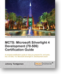

If you're looking to become an MCTS certified Silverlight developer, you might want to do so through the guidance of a certification guide.   
Packt Publishing has a book by Johnny Tordgeman, to do just that.  You can go get it [here](http://www.packtpub.com/mcts-microsoft-silverlight-4-development-70-506-certification-guide/book).

**About the book**  
The book will take the readers through the process of laying out a user interface in Silverlight using concepts such as panels, content controllers and navigation. Readers will also learn the configuration, delivery and deployment of a Silverlight application and dynamically loading resources into the application, working and creating a powerful data driven line of business application. Also you'll learn to understand how to enhance the UI of your application through manipulating visual elements, creating animations and other important UI concepts.  

The book is written by [Johnny Tordgeman](http://blog.johnnyt.me/2012/07/05/my-book-is-published/), a professional SharePoint, FAST and frontend developer and trainer.

**There is a contest  
**The cool part is; Packt is sponsoring a contest, right here - on this blog; two e-book copies to be given away to two lucky winners.

**How can I win?  
**All you have to do is drop a comment below highlighting why you should win this book. Don't forget to post how we can hold of you; a twitter alias, obfuscated mail address or similar.

**Duration  
**The contest will be valid for 7 days from this post - meaning that you'll have to post a comment with a good description by July 29th.

**Selection of winners**  
Winners will be selected on the basis of their comment posted.
