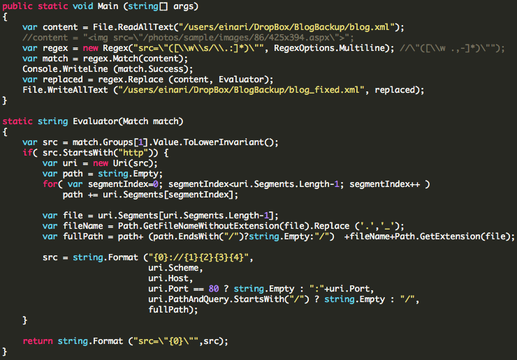

In an effort to consolidate the different sites and domains I have, I've recently gone through a bunch of moves and most recently my personal blog. Finally managed to get it off of the [BlogEngine.net](http://www.dotnetblogengine.net/) solution it was running on that I had done some customizations on and got it hosted on [Wordpress.com](http://wordpress.com) - for my needs, this is perfect. I just want a service that runs and works. 

But it proved to be far more challenging than I had originally thought. First of all, the format that [BlogEngine.net](http://www.dotnetblogengine.net/), at least the version I was running, could export to was BlogML. A format that Wordpress.com could not import out of the box.

But lucky enough, asking on Twitter pays off, as it normally does. [James Paulp](http://www.jamespaulp.com/) came to the rescue.

The [article](http://www.craigbailey.net/migrating-from-blogengine-net-to-wordpress/) basically describes the process of exporting to BlogML, installing Wordpress locally, installing a BlogML import plugin, import it into that and then export it into a Wordpress XML format and put that into Wordpress.com. 

A process that seemed simple enough, but you would have to do any media or attachments for yours posts manually. Meaning that you would need to upload these and sort out the URLs manually by search/replacing your way through the XML before importing.

Again, pretty straight forward, except for one fact - a lot of my older posts were still pointing to images that was still being served from a [Community Server](http://telligent.com/support/communityserver/) installation I used to host my blog on earlier on a different domain. So now I had two sources of images, and of course it had to take me like 2-3 imports into Wordpress.com to discover this. 

Finally, everything in place, all resources mapped as they should and uploaded to Wordpress.com. Bam..  No images displaying still.

Turns out, Wordpress.com is case-sensitive on the filenames for media, and when you upload media they are being turned into lower-case. Fantastic when all your stuff is mixed case. In addition it turns out that it also switches any dots in filenames of your media around to be an underscore.

So a C# snippet later, most of my content is fine - I just need to fix a couple of older posts manually. Fine, and not the end of the world - so I'll just walk through my posts and do it by hand.

