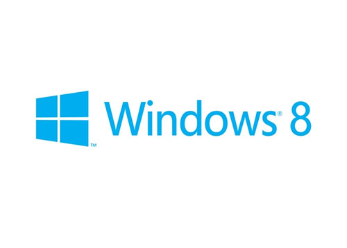

Windows 8 is around the corner and I was asked to do a talk for a kickstart event Microsoft is doing. 

My Talk will be on doing metro apps with HTML, CSS and JavaScript, how you can leverage your existing Web experience and knowledge and take advantage of some of the functionality specific to Windows 8.

The event will be in Oslo @ Microsoft Norway. If you're interested, jump over to [here](https://msevents.microsoft.com/cui/m/EventDetail.aspx?EventID=1032519948&Culture=nb-NO&community=0) to register for it.

