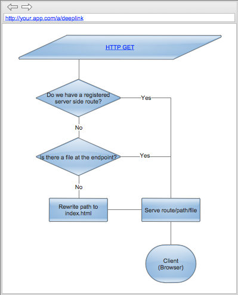

One of the things that has been discussed the last couple of years for [single-page applications](http://en.wikipedia.org/wiki/Single-page_application) are how to deal with routing since rendering and composition in those kind of applications is being dealt with on the client. Many have been pointing to using the hash (#) as a technique since this is for one possible to use to change history in the browser without post-backing for browsers that does not have the new [HTML5 history API](http://html5demos.com/history/). This works fine for applications and is very easy to respond to in the client, but the URLs become unfamiliar and looks a bit weird for deep-linking. In order for search crawlers to crawl content properly, a specification exist that also states the inclusion of a ! (bang) yielding a #! (hash bang) as the separator for the specific route.  In [Bifrost](http://bifrost.dolittle.com) we have been working quite a bit the last six months in order to get a model that we believe in for single-page applications. Many models build on relying partially on the server for rendering, but composing the rendered parts in the client. With Bifrost, we wanted a different model, we wanted everything to be based on regular static HTML files sitting on the server, without having any load on the server for rendering - just serve the files as is. Instead, we wanted to compose the application from files on the server. One of the challenges we wanted to crack was to have regular URLs without any # or #!, even for HTML4 browsers - or at least in any anchors linking inside the app. In order for this to work, you need to deal with requests coming to the server with routes that has no meaning for any server code running. One of the motivations were also to not have to do anything specific for any routes on the server, meaning that you wouldn't need to configure anything for any new routes you wanted - everything should be done only once on the client.

# The problem

The nature of a single-page application is that it basically has a start page, and all requests should go to this page. This page represents the composition of the application, it has enough information and scripts on it to be able to render the remainder of the app based on any URLs coming in. In order to accomplish this, the server must be able to take any URLs coming in and pretty much ignore the URL - unless of course there is something configured or a file exist at the specific URL. 

# Our solution

Bifrost is for now built for .net and more specifically ASP.net, so we had to dig into that platform specifically to figure out a way to deal with this. What we discovered is a part of the request pipeline in ASP.net that we could hook into and do a rewrite of the path during a request. (The implementation can be found [here](https://github.com/dolittlestudios/Bifrost/blob/master/Source/Bifrost.Web/Pipeline/SinglePageApplication.cs).)

# What about the client?

Another challenge is to deal with history without post-backing. The way we've built everything is that you as a developer or web designer does not have to think about wether or not this is a Bifrost app or just a regular HTML app, you just create your anchor tags as usual. Just create your links as before, no hash-bangs nothing special - have your full paths sit there. This also makes it work just great with search-engines and they will be able to crawl your content and get the proper deep-links and index you. But we need to hook into the browser still, so we don't do a post-back to the server for any URL changes. The way we've chosen to deal with this is to [hook into the body and deal with it through event-bubbling](https://github.com/dolittlestudios/Bifrost/blob/master/Source/Bifrost.JavaScript/navigation/navigationManager.js). Any click events occurring inside the document will then be captured and if it happens to be an anchor tag that is the source, we pull out the URL and rewrites history inside the browser. Since we're using [Baluptons History.js](https://github.com/balupton/History.js/), we get support for HTML4 browsers as well. History.js will use hash in those scenarios were it can't rewrite the path, but your URLs does not have to change - it will just use it internally and it will all be abstracted away.
