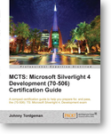

I've had the pleasure of getting early hands on for the MCTS certification guide for Silverlight 4, and figured I'd do a short review of it.

The purpose of the book is to give you a guide of what to expect to know for becoming a certified Silverlight developer. Personally I haven't done the certification, so I won't be able to say if it is sufficient or not, but I would imagine that the certification itself has been used as a guide for what is needed.

Silverlight 4 is a pretty large subject on its own, and quite ambitious to cover in just one book and at the same time provide guidance towards a certification. I feel that this book really accomplished this in a good manner, it is straight to the point but at the same time not leaving out any explanations. I even picked up some basic knowledge I was not aware of myself. 

Being a guidance for certification, it does just that, so its not going to go outside of that promise. Which probably makes it feel a little light-weight on real world scenarios and it stays true to the original Microsoft messaging. It mentioned MVVM to some extent, but it could probably have dove into that subject a bit more, in my opinion. But I totally understand why it is not brought up. Being very focused on code quality, testability and such I feel that it is important to get this message straight, even though it might not be 100% relevant to a certification. 

All in all I found the book to be as close to a page turner as these kind of books can be, I learned some basics myself and brushed up on my own knowledge of Silverlight while reading it. And I'm pretty confident it will serve as a good guide for a developer wanting to certify him/her-self as a Silverlight developer.
