\[UPDATE: Want a Norwegian translation of this, you can find it [here](http://www.utdannet.no/2015/01/slik-flytte-fra-wordpress-til-microsoft-azure/)\]

I decided to move from a hosted WordPress solution on WordPress.com to an installation sitting in Microsoft Azure. The reason for this is that I want to be able decide what content to post myself. WordPress.com has a limitation on what is allowed, and when running Open Source projects - I do get some donations from companies every now and then and I want to put posts up with logo and link back as a thank you to the ones donating. This could be considered ads when reading the terms and agreement from WordPress.com and not allowed. I figured I wanted to have editorial control myself of whats ok and not. Besides, being a huge fan of Azure, I’ve always wanted to host my blog on it. You might be asking, why don’t I write my own blog engine - seeing that I’m a dev. Well, I used to have my own before - but I don’t really have time to maintain it myself, I just want something that works. The choice of WordPress might seem odd as well, but again - its just me picking what is the most convenient to me; I can export from WordPress.com and directly into this with the least amount of hassle - which brings me to the real purpose of this post; a walkthrough of how I moved to Azure. This tutorial is most likely applicable to any other hosted WordPress service you might be using as it is basically just using WordPress features. 

  

# Exporting from WordPress.com

The first thing you want to start with is logging into your WordPress.com account and export your site. I use the classic menu @ WordPress.com - you’ll find it under Tools | Export.

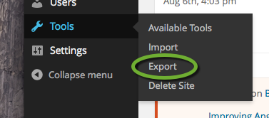

  

If you want to completely migrate, chose “All content”.

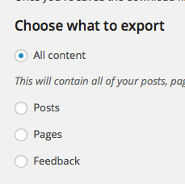

Click the  button and you should get an XML file:

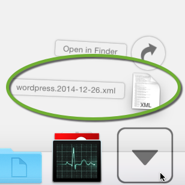

  

This is all we need from WordPress.com

  

# Setting up a new site in Azure

I’m going to assume that you’ve signed up for [Azure](http://azure.microsoft.com). From the management portal of Azure, you simply select the New button in the lower left corner.

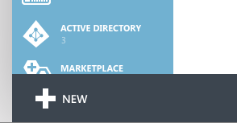

  

Then Comput | WebSite | From Gallery. 

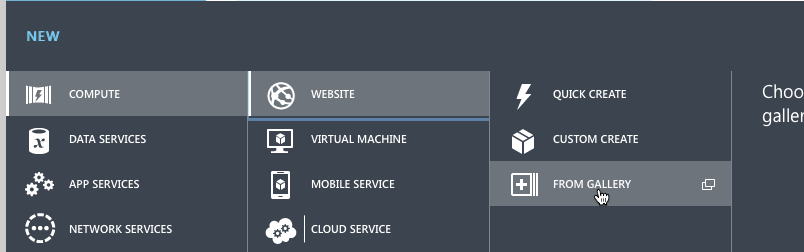

  

You’ll then get a wizard popup. Find WordPress in the list at the bottom and select it.

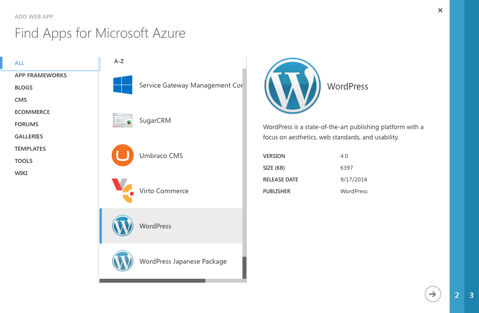

  

Click the arrow in the lower right corner to move to the next step.

From this its only the URL, DATABASE and WEBSCALEGROUP you need to care about. The URL is the public URL you want your blog to have. If you want a custom domain, we can add this later.

  

For the DATABASE you have the option using an existing or creating a new. You can only add one blog using the “Create a new MySQL database” option, after that you will have to manually add a MySql database from the marketplace and then use the “Use an existing MySQL database” option. The last option of WEBSCALEGROUP lets you chose where to host your blog - geographically. I’ve used North Europe, which is the Ireland based datacenter. If you are unsure which one to chose, go to the [Azure region details](http://azure.microsoft.com/regions/) to find the one closest to you and the readers of your blog.

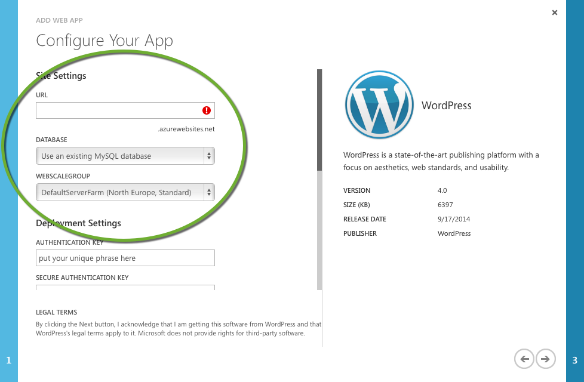

  

For my first blog that I’m migrating I selected the “Create a new MySQL database” option which then gives the oportunity to give the database a name and again a region. It is smart to have the region be the same as your blog. In the lower left corner you will also have to agree to the ClearDB’s legal terms. And then you’re set to go. When it is ready, you will have to go to the URL you gave and finish the WordPress installation by setting the administrator username and password.

  

# Setting up a theme

You probably want to personalize your blog and find the appearance you want. In the default installation there is 4 themes, if you want something else, you will have to “Add New Theme” from the Appearance menu item in the dashboard.

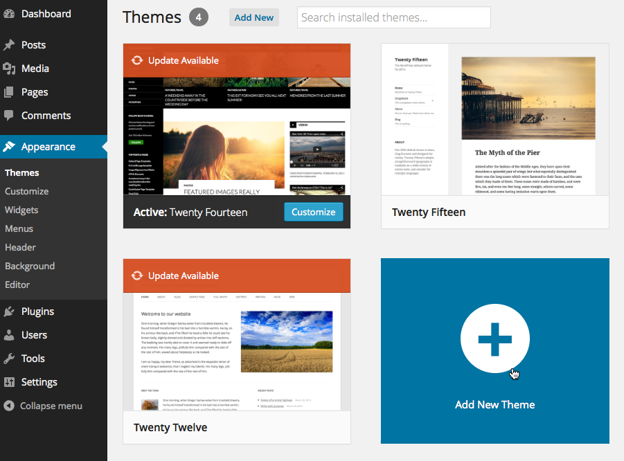

  

If you’re like me and you want to have the same theme you had on WordPress.com, you can just search for it and see if its available and add it.

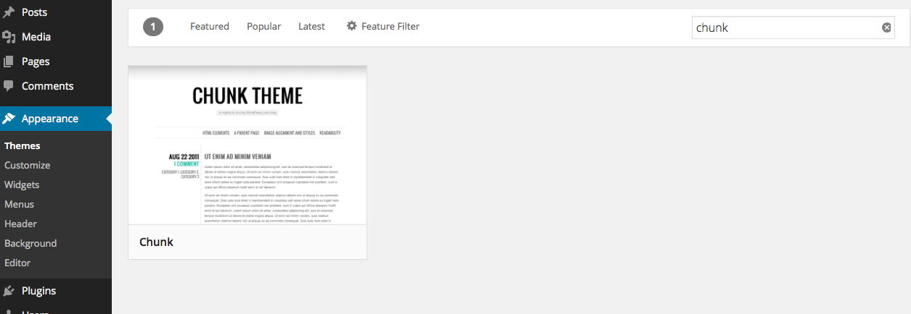

  

Once you’ve found your theme, activate it.

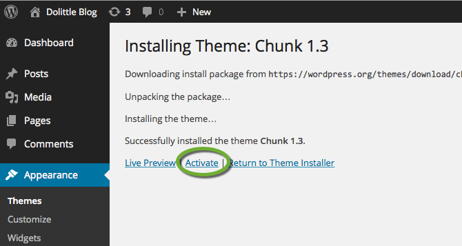

  

  

# WordPress Importer

Now its time to get the content back by importing it. Go to Tools | Import in the dashboard menu.

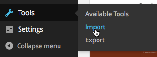

  

Select WordPress.

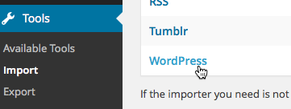

  

Click the  button to find the XML file on your computer. 

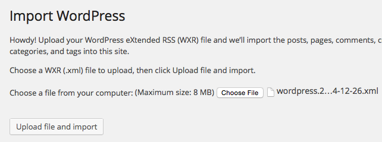

  

Then click .

  

You will now have to map users from your WordPress.com authors to users on the new installation. You do get a change to create new logins if you have multiple authors coming in. If you want the attachments to be available on your new site and not be linked back to the original location where they came from, you need to tick off the “Download and import file attachments”.

  

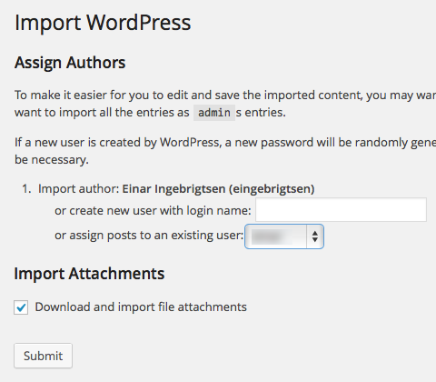

  

# Import External Images

After importing your content, images might still be stuck on the WordPress.com site. Hovering any of the images you’ll see the URL point to a WordPress.com address. To be sure they are all stored in the new site, there is a plugin that we can use to import all external images. All you need to do is go to Plugins on your dashboard and then Add new, put in “Import External Images” in the search field and hit enter. You should get the plugin and then click the  button.

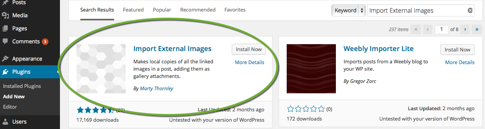

  

  

  

Once this is installed you’ll have a new option under the Media menuitem in the dashboard. Set the options thats right for you and click .

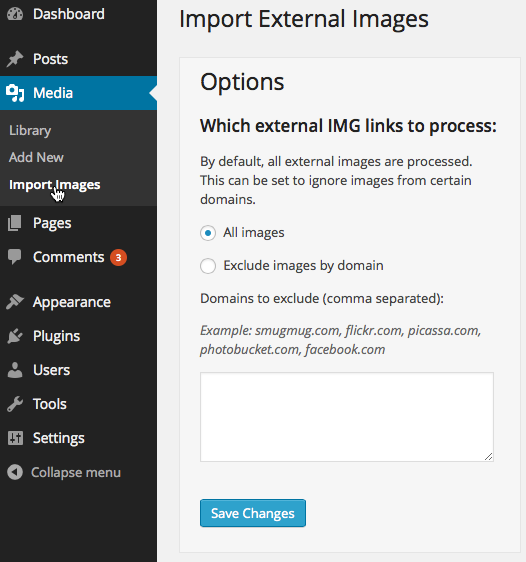

  

  

  

# SyntaxHighlighter Evolved

Since I blog about code for the most part, I need to have my code look good on the page. This is called syntax highlighting. It will colorize the code appropriately and make the code stick out on the page. The plugin used on WordPress.com is the SyntaxHighlighter Evolved. All you need to do is go to Plugins on your dashboard and then Add new, put in “SyntaxHighlighter Evolved” in the search field and hit enter. You should get the plugin and then click the  button.

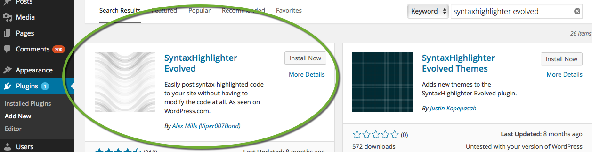

  

# Statistics

To keep an eye on how many readers you get and details about your readers, there is a few plugins available. I basically went with the first one after a search for “statistics” in plugins.

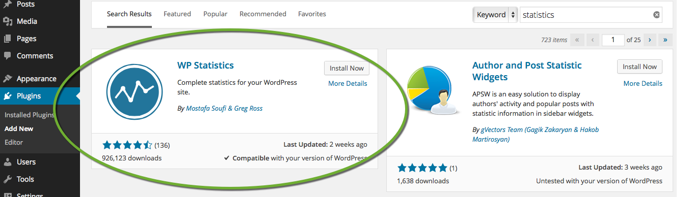

  

This will give you a new menu item in the dashboard called Statistics with a lot of different filters in the sub menu.

  

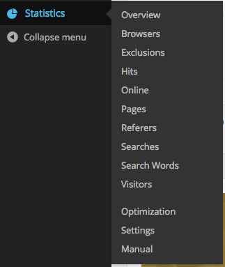

# Akismet for Anti Spam

  

I quickly realized after a couple of days that spam is really a huge problem in the comment fields of blogs. I noticed this the hard way after some 10 days with 2946 new comments on my posts. I do get comments, just not that many.

  

I chose to go with the Akismet plugin that comes preinstalled with the WordPress installation. You can chose to donate how much you want, starting with $6. After activating it, you can get it to go through 

  

One of the things I don’t want to have to do is to have to go through spam on a regular basis to allow or now. I’m basically going to trust the plugin and have it delete the worst spam. You do this by opening the plugins Settings | Akismet in the dashboard.

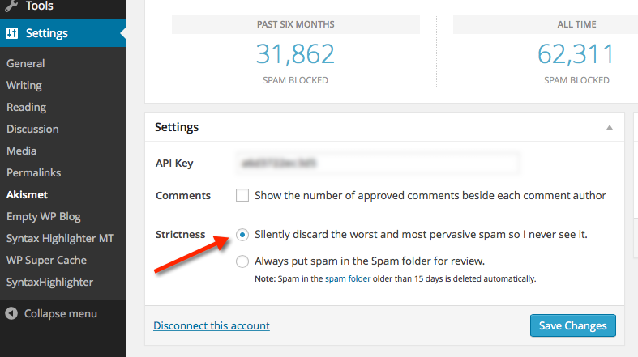

  

After activating the Akismet and you happen to have spam already sitting there, like me, you can go to the comments in the dashboard and click the “Check for Spam” button and let it run through it all.

  

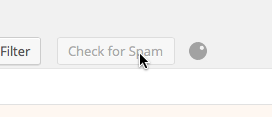

  

Since I had a lot of comments, I had to run this multiple times till I got down to 0, but it works really nice.

# Custom domain name

Its fairly simple to get your custom domain name up and running for Azure and your WebSite. Go to the Configure tab on your site.

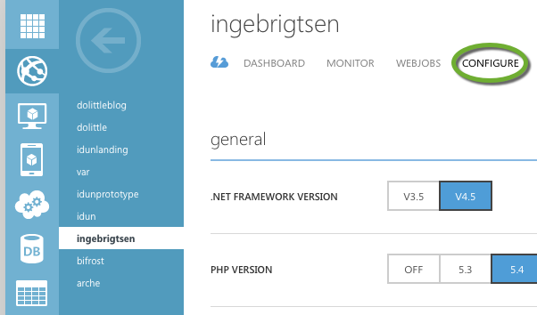

  

Scroll down to the  and click it. You should get a popup with details on how to set up the DNS records to point correctly. Basically, all you need is a CNAME DNS record representing the full DNS entry that you want for your site and then point it to the URL that set up in the beginning, in my case: ingebrigtsen.azurewebsites.net. If you had a CNAME already in place pointing to WordPress.com, you will have to wait for the time to live to expire before it is propagated throughout. 

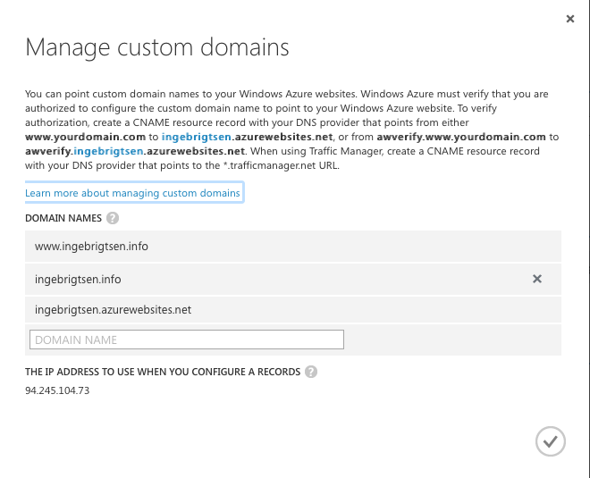

# Setting it up in your favorite writer

With WordPress you have a pretty good experience for writing posts in their editor online. But the keyword here being “online”. If you need offline writing you might have your favorite editor for doing so. Personally, I like having a desktop client for writing even if I’m connected 99% of the time. These days, I’ve fell in love with an editor called [Desk](http://desk.pm), simple and just helps me focus and gives me a certain joy in writing I thought I had lost. Anyways, with moving to Azure - you can still use your favorite writer. All you to do is point it at the blogs URL. For the XMLRPC part, some writers will figure this out others won’t. If you need to be explicit about it, just type in “xmlrpc.php” in the API url part. Then its the username and password.

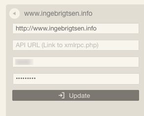

  

  

# The drawbacks

There are a few things that all of a sudden we have to consider moving away from a hosted service. Its always a balance of flexibility vs amount of work to do. In a Software-as-a-Service model, its always going to be the common denominator that is the rule and everything is taken care of - while hosting it yourself, you gain flexibility but along comes chores you didn’t have to in a SaaS world.

## Backup

Things can happen, leading to loss of service or worse, loss of data. So you want to consider setting up backup to avoid losing anything. Luckily, this is fairly easy to setup in Azure. Have a look at the walkthrough of how this is done [here](http://azure.microsoft.com/en-us/documentation/articles/web-sites-backup/).

## Updates

Everytime there is an update to WordPress or a plugin, or even the theme you selected - you 

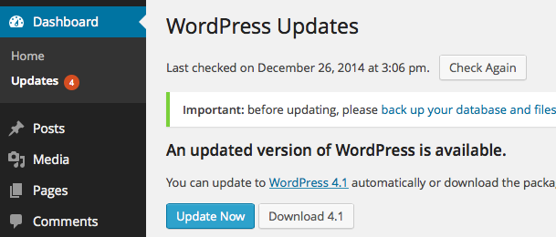

  

## Scaling

Another thing that one does not have to think of in a SaaS mode is scalign and making your site responsive and available even when there is a lot of users hitting your site. Again, Azure does really come to the rescue. There are a few options of dealing with this, you can increase the instance size, increase number of instances. There is even an [autoscale](http://azure.microsoft.com/nb-no/documentation/articles/cloud-services-how-to-scale/) option that can do this dynamically.

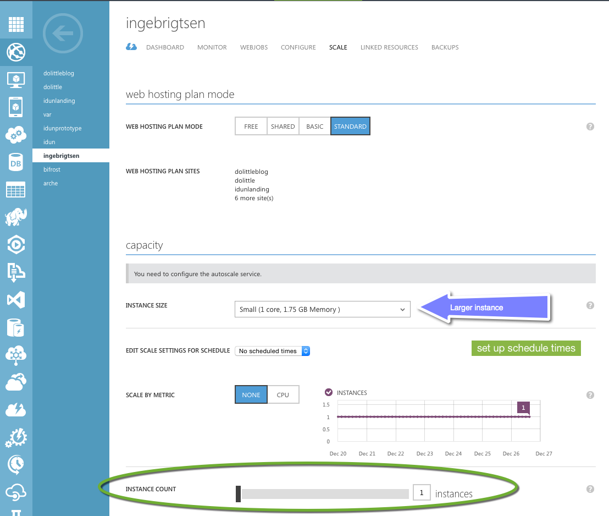

  

# Conclusion

Azure has really matured since I started back in 2008 right after PDC and the launch of Azure. The ease and consistency in UX of the service is really great. I’ve tried Amazon and I do feel its quite messy. With the new portal coming out for Azure, things are getting even easier. I think the ease of getting a WordPress site up and running on Azure proves how mature it is. Putting in place backup and scaling makes the drawbacks of hosting things myself go pretty much away. 

  

Today I use Azure for all my personal sites plus company sites. Every client we’ve had, our default answer is Azure. It comes from the fact that it is very mature - and not only for Microsoft technology, but also for things like PHP, NodeJS, Ruby on Rails or anything you want to throw at it basically, even Linux virtual machines.
