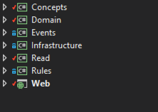

With [Bifrost](http://github.com/dolittle/bifrost) we’re aligning ourselves more and more with being a platform for doing [Domain Driven Design](http://en.wikipedia.org/wiki/Domain-driven_design). Introducing more and more artefacts from the building blocks as we go along. When we set out to build Bifrost, we decided early on to be true to not be building anything into it that we didn’t need in a real world scenario. This was after we had started falling into the pattern of **what if** of software development. We started imagining problems and had to deal with them way before they had actually happened. With the risk of generalising; a fairly common scenario amongst dirty minded tech people. It stems from experience, knowing that there will always be something that can go wrong. Sure, there always is. I digress, I think this could probably be a blogpost on its own. The point being, we were heading down this path and for some reason got jolted back to reality and we started focusing on implementing only the things we needed and rather actually go back and remove things that came out of the “**what if game”**. On this new path we wanted to also stay focused on implementing things that were aligned with DDD and keep a close eye on the user.

# Concepts

With the philosophy of [CQRS](http://martinfowler.com/bliki/CQRS.html) at heart built with [SOLID](http://en.wikipedia.org/wiki/SOLID_(object-oriented_design)) care we keep a very close eye on being very specific in our modelling. Things that are used in one part of the system is not automatically reused somewhere else, for the [DRYness](http://en.wikipedia.org/wiki/Don't_repeat_yourself). We don’t believe in DRYing up properties and we [favor composition of inheritance](http://en.wikipedia.org/wiki/Composition_over_inheritance). Logic is still kept only once, on the command side of the fence. With all these principles at hand we were missing something that would link it all back together and make things look and feel consistent.

Let’s look at a scenario; say I want to update the address of a person. A command could be something like the following:

\[code language="csharp"\] using System; using Bifrost.Commands;

public class UpdateAddressForPerson : Command { public Guid PersonId { get; set; } public string Street { get; set; } public string City { get; set; } public string PostalCode { get; set; } public string Country { get; set; } } \[/code\]

In Bifrost you’d then have a CommandHandler to deal with this and then an [AggregateRoot](http://martinfowler.com/bliki/DDD_Aggregate.html) that would probably look like the following:

\[code language="csharp"\] using System; using Bifrost.Domain;

public class Person : AggregateRoot { public Person(Guid personId) : base(personId) {} public UpdateAddress(string street, string city, string postalCode, string country) { // Apply an event } } \[/code\]

The aggregate would then apply an event that looks like the following:

\[code language="csharp"\] using System; using Bifrost.Events;

public class AddressUpdatedForPerson : Event { public Guid PersonId { get; set; } public string Street { get; set; } public string City { get; set; } public string PostalCode { get; set; } public string Country { get; set; } } \[/code\]

An event subscriber would pick this up and update a read model that might look like the following:

\[code language="csharp"\] using System; using Bifrost.Read;

public class AddressForPerson : IReadModel { public Guid PersonId { get; set; } public string Street { get; set; } public string City { get; set; } public string PostalCode { get; set; } public string Country { get; set; } } \[/code\]

That was the artefacts we would typically be dealing with; command, aggregateroot, event and readmodel. For simplicity, these look pretty much the same - but they don’t have to, and in fact; most of the time they don’t. Lets address something here. We’re losing out on a potential in the modelling here. Take the Guid representing the unique identifier for the person. This is in fact something  that is part of the domain vocabulary that we’re losing by just making it a Guid directly.

In Bifrost we have something called ConceptAs that we can use to represent this domain concept. This is a base class that we recognize throughout the system and deals with properly during serialisation between the different out of process places it might go.

\[code language="csharp"\] using System; using Bifrost.Concepts;

public class Person : ConceptAs<Guid> { public static implicit operator Person(Guid personId) { return new Person() { Value = personId }; } } \[/code\]

What this does is to wrap up the primitive, giving us a type that represent the domain concept. One modelling technique we applied when doing this is to stop referring to it as an id, so we started calling it the noun in which it represented. For us, this actually became the abstract noun. It doesn’t hold any properties for what it represents, only the notion of it. But codewise, this looks very good and readable.

In the ConceptAs base class we have an implicit operator that is capable of converting from the new type to the primitive, unfortunately C# does not allow for the same implicit operator going the other way in the base class, so this has to be explicitly implemented. With these operators we can move back and forth between the primitive and the concept. This comes very handy when dealing with events. We decided to drop the concepts in the events. The reason for this is that versioning becomes very hard when changing a concept, something you could decide to do. It could also make serialization more complex than you’d hope for with some serializers. Our conclusion is that we keep the events very simple and uses primitives, but everywhere else the concept is used.

The way we structure our source we basically have a domain project with our commands, command handlers and aggregates. Then we have a project for our read side and in between these two projects sit a project for holding the domain events. With this model we don’t get a coupling between the domain and the read, which is one of our primary objectives. The concepts on the other hand, they are going to be reused between the two. We therefor always have a concepts project where we keep our concepts.

Our typical project structure:

So, now that we have our first concept, what did it do? It replaced the Guid reference throughout, introducing some clarity in our models. But the benefit we stumbled upon with this; we now have something to do cross cutting concerns with. By having the type of pipelines we have in Bifrost, we can now start doing things based on the type being used in different artefacts. Take the command for instance, we can now introduce input validation or business rules for it that would be applied automatically whenever used. Our support for FluentValidation has a BusinessValidator type that can be used for this:

\[code language="csharp"\] using Bifrost.FluentValidation; using FluentValidation;

public class PersonBusinessValidator : BusinessValidator<Person> { public PersonBusinessValidator() { RuleFor(p => p.Value) .Must(… a method/lambda for checking if a person exist …) .WithMessage(“The person does not exist”); } } \[/code\]

As long as you don’t create a specific business validator for the command, this would be automatically picked up. But if you were to create a specific validator for the command you could point it to this validator as a rule for the person property.

The exact same thing can then also be used for an input validator, which then would generate the proper metadata for the client and execute the validator on the client before the server.

It opens up for other cross cutting concerns as well, security for instance.

# Value Objects

A second type of object, with the same importance in expressing the domain and opening for solving things in a cross cutting manner are [value objects](http://martinfowler.com/bliki/ValueObject.html). This is a type of object that actually holds information, attributes that have value. They are useless on their own, but often used in the domain and also on the read side. Their uniqueness is based on all the fields in it. We find these in any domain all the time, they are typical things like money, phone number or in our case address. These are just the off the top of my head type of value objects you’d have, but you’ll find these in many forms. Lets tackle address:

\[code language="csharp"\] using System; using Bifrost.Concepts;

public class Address : Value { public string Street { get; set; } public string City { get; set; } public string Postal { get; set; } public string Country { get; set; } } \[/code\]

 

The Value baseclass implements IEquatable and deals with the property comparisons for uniquness.

With the value object you do get the same opportunities as with the concept for input and business validation, and yet another opportunity for dealing with cross cutting concerns.

If we summarize the sample before with these new building blocks, we would get:

\[code language="csharp"\] using System; using Bifrost.Commands;

public class UpdateAddressForPerson : Command { public Person Person { get; set; } public Address Address { get; set; } } \[/code\]

Our event:

\[code language="csharp"\] using System; using Bifrost.Events;

public class AddressUpdatedForPerson : Event { public Guid PersonId { get; set; } public string Street { get; set; } public string City { get; set; } public string PostalCode { get; set; } public string Country { get; set; } } \[/code\]

As you can see, we keep it as it was, with the properties all in the event.

Our AggregateRoot:

\[code language="csharp"\] using System; using Bifrost.Domain;

public class Person : AggregateRoot { public Person(Guid person) : base(person) {}

public UpdateAddress(Address address) { Apply(new AddressUpdatedForPerson { Person = Id, Street = address.Street, City = address.City, Postal = address.Postal, Country = address.Country }); } } \[/code\]

The readmodel then would be:

\[code language="csharp"\] using System; using Bifrost.Read;

public class AddressForPerson : IReadModel { public Person Person { get; set; } public Address Address { get; set; } } \[/code\]

# Conclusion

For someone more familiar with traditional N-tier architecture and modelling your [EDM](http://en.wikipedia.org/wiki/Enterprise_Data_Modeling) or rather than separating things out like this, this probably raises a few eyebrows and questions. I can totally relate to it, before starting the Bifrost journey - I would have completely done the same thing. It seems like a lot of artefacts hanging around here, but every one of these serves a specific purpose and is really focused. Our experience with this is that we model things more explicitly, we reflect what we want in our model much better. Besides, you stop having things in your domain that can be ambiguous, which is the primary objective of DDD. DDD is all about the modelling and how we reach a ubiquitous language, a language that represent the domain, a language we all speak. From this perspective we’ve found domain concepts and value objects to go along with it to be very useful. With them in place as types, we found it very easy to go and retrofit cross cutting concerns we wanted in our solution without having to change any business logic. When you look at whats involved in doing it, its just worth it. The few lines of code representing it will pay back in ten folds of clarity and opportunities.
