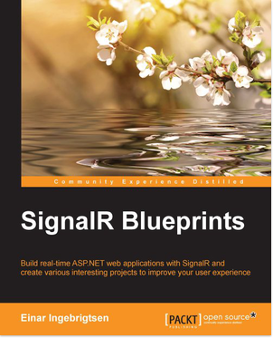

When I wrote my first book; [SignalR: Real-time Application Development](https://www.packtpub.com/application-development/signalr-real-time-application-development), I was not entirely sure I’d ever write another anytime soon. First time author and a bunch of rookie mistakes during the initial draft of the book costed me a lot of blood and sweat getting to the second draft and then eventually the release. Even though not a big book, I was exhausted trying to juggle the writing and doing my day job. But got back on the bandwagon and eventually started on my second book, this time around actually learning from the mistakes and the whole process was so much smoother.

The end product; SignalR Blueprints. 

 

You can get it as print or eBook from [Packt](https://www.packtpub.com/web-development/signalr-blueprints) or [Amazon](http://www.amazon.com/SignalR-Blueprints-Einar-Ingebrigtsen-ebook/dp/B00U1D9WZU/ref=sr_1_1?ie=UTF8&qid=1426140719&sr=8-1&keywords=einar+ingebrigtsen).

  

# The elevator pitch

SignalR is a piece of tech that opens up great opportunities for your apps. It enables a client connected to your server to be persistently connected allowing the server to push messages to any connected client. This opens up a pathway for new ways of doing things, making our software better in technological terms but also from a user experience perspective, which is the biggest reason one should pick up on this. SignalR Blueprints takes you on a journey presenting the usage of the technology paired with different environments ranging from ASP.NET MVC to CQRS based onto mobile devices such as Windows Phone, iOS and Android using Xamarin with a high focus on code quality all the way through but more importantly a high focus on the user.

  

# Thanks are in order...

I’d like to thank the entire editorial staff at Packt for pointing me the right direction and making it a smooth process. High five and great thanks to Sumeet Sawant and Shashank Desai for their excellent work as respectively Content Development Editor and Technical Editor, you and your teams have really helped raise the quality of the product. A big thanks to the technical reviewers as well; Dejan Caric, Anup Hariharan Nair and Michael Smith.
