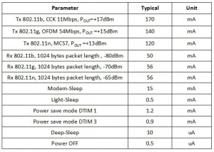

Back in the days when I got started with computing as a kid, we soldered our commodore 64s quite a bit. We added things like reset buttons, which the computer didn’t have and similar. We modified like crazy, to make our every day of coding easier.

I left this itch behind for years until a couple of years ago when I started playing with the [.NET Gadgeteer platform](http://netmf.com/gadgeteer). Lowering the threshold to a bare minimum to get started. I ended up buying a lot of sensors and modules, but really didnt’t have a project to use all the stuff I had bought - until about a year ago. We had only ony remotecontrol for our garagedoor and I started looking at buying a second one. They were so expensive and I decided to build my own. It quickly exploded in what I wanted to do; it had to have RFID and eventually an app and much more, things like geo-fencing for automatic opening when I got close to home.

With high spirit I went all in and got it up and running on first attempt. There was a problem however, there were edge cases that caused the relay to generate an interrupt in the gadgeteer that looked like the button I had attached was clicked whenever the original remote was clicked. With next to no real understanding of how the electronics really worked, this completely stopped me in my tracks and I abandoned the project till I had figured out how to fix this. Then I discovered [ESP8266](http://www.esp8266.com) after an internal hackathon we had @ work. My mind was blown with the [price](http://www.aliexpress.com/item/Free-Shipping-1pcs-lot-ESP8266-remote-serial-Port-WIFI-wireless-module-through-walls-Wang/2054386596.html?spm=2114.01010208.3.2.UTXitZ&ws_ab_test=searchweb201556_1,searchweb201644_1_505_506_503_504_301_10020_502_10001_10002_10017_10010_10005_10006_10011_10003_10021_10004_10022_10009_10008_10018_10019,searchweb201560_1,searchweb1451318400_-1,searchweb1451318411_6449&btsid=64d54443-6a3b-4aed-a592-9a3c5483acbd). You could get for less than 2 USD, and it included a WIFI adapter onboard. My frame of reference being the Gadgeteer platform where you could easily end up paying 80 USD just for the WIFI adapter alone.

# ESP

So, a computer - very small, with a 80/160 MHz CPU and a WIFI for under 2 USD. What could we do with this. Well, it does not provide the abstraction of the gadgeteer platform. But it is really not hard to dive in still. Sure, a few more things, different tools and a bit more hardcore - but very doable. Firstly, there are a few versions of the ESP. The simplest being the ESP-01 with only 2 GPIO ranging to the ESP-12 with 11 GPIO pins. Also in the mix are all the abstraction platforms often referred to as developer versions built on top of this to make it simpler to work with by exposing a USB header in front to be able to connect it directly to your computer. There is a good comparison of the most common ones [here](http://blog.squix.ch/2015/03/esp8266-module-comparison-esp-01-esp-05.html). I ended up researching this myself and ended up buying a lot of variations. My conclusion is that I will be running the [ESP-07](http://www.aliexpress.com/item/ESP8266-serial-WIFI-model-ESP-07-Authenticity-Guaranteed/32340787203.html?spm=2114.01010208.3.1.v9JaHX&ws_ab_test=searchweb201556_1,searchweb201644_1_505_506_503_504_301_10020_502_10001_10002_10017_10010_10005_10006_10011_10003_10021_10004_10022_10009_10008_10018_10019,searchweb201560_1,searchweb1451318400_-1,searchweb1451318411_6449&btsid=41a4361b-b802-48e6-a4d6-ce77638310aa) for those scenarios when I want an external antenna for better reception and ESP-12 when I need more GPIO and ESP-01 for my basic projects.

# Getting started

The easiest way to get started is to get one of these development boards. You should get a breadboard. But, I want to point out however - getting up and running without a development board is fairly easy. A bit more connecting things manually, but very rewarding when its done. Besides, tons of learning on the way - which I find the most important part of my journey. Anyways, to satisfy both cases there are kits out there that provide you with the breadboard, power supply for the board, USB to UART and the necessary wires. For instance this [kit](http://www.aliexpress.com/item/1LOT-WIFI-Test-Kit-ESP8266-WIFI-module-USB-to-UART-5V-3-3V-Power-Module-400/32252461047.html), which I bought. The USB/UART module here is based on the Prolific PL2303 and you need a driver for it, which can be found [here](http://www.prolific.com.tw/us/showproduct.aspx?p_id=229&pcid=41).

If you’re going to be working a lot with the ESP-01, I recommend getting a breadboard adapter to easily connect and disconnect your ESPs. I bought [this](http://www.aliexpress.com/item/Breadboard-adapter-for-ESP8266-Serial-to-WiFi-transceiver/32281305443.html).

Moving beyond the breadboard when you’ve prototyped things, you can step up the game by going for the [prototype PCB boards](http://www.aliexpress.com/item/20pcs-lot-5x7-4x6-3x7-2x8-cm-Pcb-Double-Sided-Copper-Prototype-Universal-PCB-Board/32335375948.html). Lowering the footprint and making it more permanent, but without having to play with chemicals or send your [Fritzing drawing for production](http://fab.fritzing.org/fritzing-fab). I’ve personally not reached the Fritzing level yet - but aiming for it - so I’m happy playing with my soldering iron on the prototype boards for now.

Making things nice and feel more like proper devices instead of a spiderweb of wires coming out of your project, you can look at using connectors - you can get all kinds. I’m trying out different ones, for instance the [3 pin](http://www.aliexpress.com/item/100pcs-Lot-3-Pin-Connector-Leads-Header-2-54mm-XH-3P-Kit-Housing-Pin-header-Terminal/828059940.html) connector.

# Power

One of my goals has been to create small self-contained devices, preferably with a certain [WAF](https://en.wikipedia.org/wiki/Wife_acceptance_factor). This has meant that some sort of embedded power is important. This could be battery or its own AC/DC adapter making it possible to put it directly into a power socket for instance. All the components are easily accessible. For instance, there are some very neat and small AC/DC adapters for only 2-3 USD. If your project needs only 3.3 volts, you could go for [this](http://www.aliexpress.com/item/220v-3-3v-ac-DC-isolated-power-supply-module-HLK-PM03-switching-step-down-power-module/32574466150.html). If you need 5 volts, then [this](http://www.aliexpress.com/item/Free-Shipping-1pcs-lot-HLK-PM01-AC-DC-220V-to-5V-mini-power-supply-module-intelligent/32408565688.html) could fit the need. The ESP runs on 3.3 volts, so you would need to step down the 5 volts using a step-down converter like [this](http://www.aliexpress.com/item/mini-2-in-1-DC-DC-Step-Down-Step-Up-Converter-1-8V-5V-to-3/32351396984.html). If you need more than 100mA for over time you need to look at other options. Remember however, working with AC is a lot more risky than the DC low voltage, low current things you end up with and you must be sure that the adapters are good quality so you don’t end up with a fire hazard. An option to this would be to just embed a USB charger, they tend to be small enough. Then at least you’re using something that is well tested and won’t invalidate your insurance.

What about those projects you want to place where there is no power source? There are quite a few options when it comes to batteries. You can use anything from a couple of [AA batteries](https://en.wikipedia.org/wiki/AA_battery) to a special purpose lithium polymer battery like [this](http://www.aliexpress.com/item/Size-367594-3-7V-3800mah-Lithium-polymer-Battery-With-Protection-Board-For-GPS-Tablet-PC-Digital/32215777494.html?spm=2114.01010208.3.81.PWs4Qd&ws_ab_test=searchweb201556_1,searchweb201644_1_505_506_503_504_301_10020_502_10001_10002_10017_10010_10005_10006_10011_10003_10021_10004_10022_10009_10008_10018_10019,searchweb201560_1,searchweb1451318400_-1,searchweb1451318411_6449&btsid=c24f79f4-6c56-4e95-91dc-9d66748ade2d) or if you need something like 6000 mAh you can go for something like [this](http://www.aliexpress.com/item/Shun-Special-6000mAh-686690-3-7V-lithium-polymer-battery-charger-mobile-emergency-power/32377962742.html?spm=2114.01010208.3.111.gtanCv&ws_ab_test=searchweb201556_1,searchweb201644_1_505_506_503_504_301_10020_502_10001_10002_10017_10010_10005_10006_10011_10003_10021_10004_10022_10009_10008_10018_10019,searchweb201560_1,searchweb1451318400_-1,searchweb1451318411_6449&btsid=56d74ab0-6719-4659-b64a-38d10e6963cd). There are chargers out there for these, but I’ve been looking at this and wanting to make it with an embedded charger and just expose an USB. Luckily there are solutions for that with something like [this](http://www.aliexpress.com/item/1Pc-5V-18650-Lithium-Battery-Charging-Board-Micro-USB-1A-Charger-Module-g/32322489991.html?spm=2114.10010108.100010.10.J76zua#magnet-ads). These types of batteries is my goal in the long run, but for now I’m fiddling with regular AA batteries and also the [18650 batteries](http://www.aliexpress.com/item/6Pcs-lot-3-7V-18650-battery-6800mAh-Li-ion-Rechargeable-Battery-for-Flashlight-3-7v-18650/32264210647.html), packing a whopping 6800 mAh. Since they deliver 3.7 volts and have this capacity, I figured I could do with one battery for each project. So I went for [this case holder](http://www.aliexpress.com/item/New-1-x-18650-Black-Battery-Case-Holder-Storage-Box-Holder-for-1-x-18650-Battery/2046088468.html). I also bought a [charger](http://www.aliexpress.com/item/18650-Battery-18650-Charger-EU-Plug-Battery-Charger-D2-Digcharger-For-18650-Rechargeable-Li-Ion-4200mAh/32353379953.html) for them. For holding your regular AA batteries, you can get something like [this](http://www.aliexpress.com/item/F01951-Hold-2x-1-5V-2A-AA-Cell-Power-Battery-holder-box-case-For-Light-Telephone/511606152.html).

An interesting aspect when it comes to power is to make sure the device is not drawing more power than it needs to. Luckily the ESP has a few tricks up its sleeve that we can utilize to achieve this. Looking at [Espressifs site](http://bbs.espressif.com/viewtopic.php?t=133), you’ll find the different consumptions you can go for.

For some purposes you might want to go all the way down to deep-sleep and just come out of it on a regular basis. If you’re measuring something on an interval for instance. The ESP-01 does not support the deep-sleep from a hardware perspective, but with some wizardry on the hardware you can get it to support it. Have a look at [this](http://tim.jagenberg.info/2015/01/18/low-power-esp8266/). The beauty of this is that you can easily with the battery options I’ve mentioned get a solution that can last for years.

# Development Environment

The default firmware will let you develop using C and you can lower the treshold using the Arduino IDE. Another option is to go for [LUA](http://www.lua.org/), which the [NodeMCU](http://www.nodemcu.com/index_en.html) for instance comes with. To be honest it does not really matter which language you chose - as it will most likely be very small programs you’re writing anyways. That being said, I focused my effort pretty early on [Espruino](http://www.espruino.com/EspruinoESP8266) - it enables JavaScript. Sure, I’ve read the [Pragmatic Programmer](https://duckduckgo.com/y.js?u2=http%3A%2F%2Fwww.amazon.com%2FThe-Pragmatic-Programmer-Journeyman-Master%2Fdp%2F020161622X&a=osx) and should probably have chosen LUA, since I don’t know it - C is something I know very well, having written it professionally for 10 years. But couldn’t really see the huge benefit for me in this scenario, besides - LUA is not that different from JavaScript.

Flashing is pretty simple with the right tools. First you need to get the firmware from [here](http://www.espruino.com/Download). The flashing process is described [here](https://github.com/tve/EspruinoDocs/blob/master/tutorials/ESP8266_Flashing.md) for all operating systems.

Once you’re up and running with flashing, you can use something like the [Espruino Web Ide](https://github.com/espruino/EspruinoWebIDE) to do your development. It works fine and enables you even to connect to the ESP over WIFI. The ESP has a Telnet server, so once you’ve configured the network on the ESP you can simply telnet to it on port 23. Read more about configuring the network on your ESP and how this all works [here](https://github.com/tve/EspruinoDocs/blob/master/tutorials/ESP8266_WifiUsage.md).

My goal however is to be using [Visual Studio Code](https://code.visualstudio.com) for development and connecting to the board when I want to try things out. A promising project could then be [this](https://github.com/aaronpowell/vscode-espruino). I failed at getting it to work. I therefor started looking at alternative approaches to let me stay inside Visual Studio Code but just connect to the device and upload code easily. There is for instance the [EspruinoTools](https://github.com/espruino/EspruinoTools) that has a CLI tool. Unfortunately, this tool does not have the scenario of connecting over WIFI, which I found to be very good for me. So I ended up starting on a tool my self that can be found [here](https://github.com/einari/espruino-helper). My first goal is to hook these up inside VSCode by using the [task system](https://code.visualstudio.com/Docs/editor/tasks). Who knows, maybe I’ll move beyond it - providing a more integrated experience.

Another thing that I find important for me is to be able to write nicer JavaScript. This is just an itch that I have, I could easily do all my work with the toolset I’ve described. I just have this “if I know I can do something better, I better do it”-itch. So [ES2015](http://www.ecma-international.org/ecma-262/6.0/index.html) is a clear goal. This can be achived using things like [BabelJS](http://babeljs.io). I’m working on a set of Gulp tasks to do this. Sure, there is a slight overhead with this on the memory footprint. But with bundling and [minification](https://en.wikipedia.org/wiki/Minification_(programming)) in combination, I should be able to aleviate some of this. Besides, I think memory is not going to be an issue for most of my projects. Well, at least not until I start pulling in [MQTT](https://en.wikipedia.org/wiki/MQTT) [libraries](http://www.espruino.com/MQTT) or similar. :)

# Summary

The treshold for building IoT stuff today has really been lowered. Sure, we can still do things like the gageteer things or maybe even better yet for kids do something like [LittleBits](http://littlebits.cc). Once you get the hang of things and have an urge for diving deeper, it still is not all that hard. I’m impressed with the amount of resources out there, so learning should really just be a question of crawling the web - and it shouldn’t be hard. The hardest part I found was getting the vocabulary right. What are the names of all the things I needed for my projects. This is still a pain point, but I’m not sweating it too much - I see that it increases day by day. I’m totally hooked and really have found a hobby that is a lot of fun where I can also build things that are somewhat useful at the same time.

One thing I find really interesting is the evolution of the ESP platform, it has exploded in just a couple of years - and its still being pushed forward. The upcoming member to the family; [ESP32](http://esp32.com) is very interesting with its bluetooth option and more GPIO. Really looking forward to it coming out.

Hope you found this writeup useful - feel free to add pointers and correct me if I’m wrong on things in the writeup (I’m pretty sure I’ve misunderstood a few things in my journey thus far).
