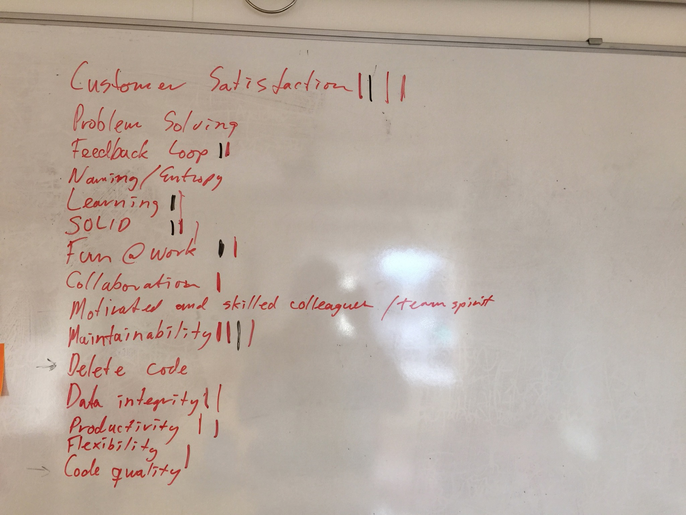

Those who have worked with me have most likely heard a few times and probably also got bored by me saying we have to establish a core set of common values before we do any code writing. What I mean by that is that you can’t have a team work in the same general direction without the team actually believing in the same things. Take a thing like being test driven. If you have a split in the team and not a common consensus of wether or not automated testing is good or bad for your team and your product, you’ll end up having tiring discussions and not establishing a climate for establishing a good culture. Worst case; you might hurt your velocity directly by not adressing a bunch of the elephants in the room and over time establish a declining velocity and not notice that it is declining.

# Elephants

Yes, there always seem to be an elephant in the room. And they are so hard to get out of the room. Subjects that are impossible to discuss, because you really can’t reach an agreement. Every place I’ve been to have these, and in my experience, there seem to be more than average in software development. I think this comes from a bunch of reasons, but in my experience it boils down to not adressing the underlying issues and also in many cases, really understand why we go to work. In our industry there are some elephants seem to be quite common, things like my favorites; performance and the “keep it simple stupid”-principle. Performance is by some the trump card, whenever a discussion gets out of hand, you might run the risk of this card; hoping it will kill the discussion and we can move along.

# Business Value

Why we as developers go to work is something that can be hard to remember. Our job is to add business value to the place we work. It is so easy to forget this fundamental thing and end up doing things that is not related to this, often based on an established culture of developers having the ability to just ignore this fact. By having the power to create something in code makes us experts in our fields, we do something that not many people understand what is. This power comes with great responsibility, we should not abuse this just because we want to do something exciting. Its easy to bullshit a manager into thinking that using technology X will solve all problems, while you could have done this with a different approach in shorter amount of time but you never got the chance of trying out X. Don’t get me wrong, we should always look at tools that actually improve our productivity or helps us get our business value done more accurately or delivered faster or better. Just don’t make up excuses to get to try it out to get it on your resumé.

# Lack of understanding

Lets face it, not everyone wants to learn new tricks all the time. And that is actually fine. Being conservative to change can help balance out those who wants to change everything all the time. That being said, there are also those who are conservative because its convenient, because it suits them to not necessarily go in the right direction and hinders development and moving forward. A great way to protect your own job for someone who has been there since the dawn of time and really just want to continue doing the tasks that has been mastered. In our industry I think you’d be crazy to even try to want something like this. Our industry moves quite rapidly compared to most others and knowing only things that belong to the past is not necessarily a benefit. I think this is also important to understand for some of the elephants in the room, people protecting themselves; they just don’t necessarily understand the new ways of doing things and don’t have the full motivation to actually bother learning it. A good manager should be able to pick up on this and make sure the team is motivated and keep the risk down for the company by actually facilitating for learning.

# The User

Who are these users we hear about. Adding business value is good for business, but not thinking about the user and keeping them close could be a disaster for business. So even though you think you’re adding something to your system that you believe will add business value, the users might not want it because you made it in a way the users won’t understand. This is something I see all the time; developers making software look like their development tools and thinking the users will just intuitively get it. Heck, I’ve done this myself on numerous occasions. Its like we get tunnel vision, thinking that everyone thinks like us. They don’t! We are possibly the worst frame of reference for what a user wants. This is one of the things that I think brings more elephants in the room that are not up for discussion. Because we’re used to do something, that wasn’t good for the user, we should just continue down that path.

# Being pragmatic

This I hear a lot, and it gets presented as an accusation, as if one is not pragmatic. Short and simple; it is an abused term. It is something that gets twisted to fit as a trump card and thrown on the table to stop discussions. It doesn’t really reflect a value of any sort, its just a way of hiding any core value of actually bubbling to the surface. Its often related back to the “keep it simple, stupid”-principle and is just an instrument used to belittle the other person(s) in the argument. I look at other professions whenever I encounter things like this and ask my self, would they throw this card — ever? Take a plumber, would he pragmatically drop putting in a pipe or even worse pragmatically decide to not comply with building regulations. We can do much better than this. The KISS principle is a really good example of something that has completely different meanings depending on the person you talk to as well. For some this would mean; “… put everything in a stored procedure in the database…” type of KISS, while for me it means I adhere to the SOLID principles amongst other things. I don’t like these terms - they don’t bring anything positive to the table.

# Core Values

Back to the original intent of this post; establishing core values. This is not an easy task, it is something that can take a while and it is not something you delegate to one person and hope it solves everything. It is a team effort. The team has to do this together and they are going to have to work together to get the wheels smoothly running. An approach that I’ve had great result in slight variations with, is to let every team member write down on three post-its the three most important things to them. One is not to discuss the items with anyone else, the items can be anything related to what the person consider important to be able to do their job. Every team member has to do it themselves for themselves. Put this up on a wall and let every team member present the case for their items and what they mean. You then optimize the wall by grouping the things that are the same. We now want to cut the list down, we can’t have all the items as our core most important values. Then you give the team 3 votes they can distribute on the things they now find the most interesting with the knowledge that we’re not keeping them all — chose wisely. You should now have a ranked list the things with the most votes are more important and you do a cut off at the number of items you decided to keep. I usually tend to keep it at 10. With smaller teams you might consider increasing the number of post-its and votes, so that you get more than your cutoff, even after grouping. A variation of this that I’ve used was after a disaster of a release at a company were we had a yearly release-cycle. After the disaster and weeks of firefighting I put the team together and asked them to come up with 3 post-its each for how we could make the next release even worse. This triggered something very interesting, people got really creative and every one had great ideas of how to really sabotage the next release. We then voted for the things we found most relevant and that we wanted most to do. We then took the list and we converted it into things we should not be doing and then had a cut off of 10 items that became the law of the land for the development team.

What you now have produced is something that can kill the things used to kill discussions, you have a list of things you all have agreed upon is important. It is the compromise, the things that you as a team believe in. Whenever nonsense arguments are being thrown into the mix, the different trump cards or elephants that sit in the room, you can refer back to the list.

Sometimes it is not clear cut what things mean, and you can end up having discussions about the meaning of it all. Try to capture what people are saying when presenting their post-its, put this in writing and get the team to read through and commit to this. But even after doing that, it might be hard to understand. A tool that can help with getting a common understanding is doing pair-programming as part of how you work. Circulate who pairs and start building the dynamics into the team. You end up discussing some of the items on the list and you will eventually break down barriers and create a team that at the very minimum executes more in unison. Typically the elephants can actually be taken out of the room and you will hopefully and most likely also address the lack of understanding and get to the need of learning much easier.

An example of the process is below, this is from a real exercise.

### The things that made it into the list

### The things that didn’t make it into the list

### The board of votes

# Conclusion

Though probably not perfect, it is a way of getting the conversation going and making everyone aware of the fact that we have to be on the same page. You should never underestimate the importance of having the team thinking pretty much the same, and you need to address the core belief system in order for you to be close to getting your team thinking in the same terms. Having a team that anticipate each other and can have a dynamics together that pulls in the same direction gives higher velocity in the long term and also helps people keep motivated. Nothing is worse than not being motivated to go to work because of elephants and established truths. It can feel constraining and for someone not in the same mindset, completely arbitrary because the world has moved on ages ago.

Bottom line; communication is super important and probably the hardest thing to get right.
