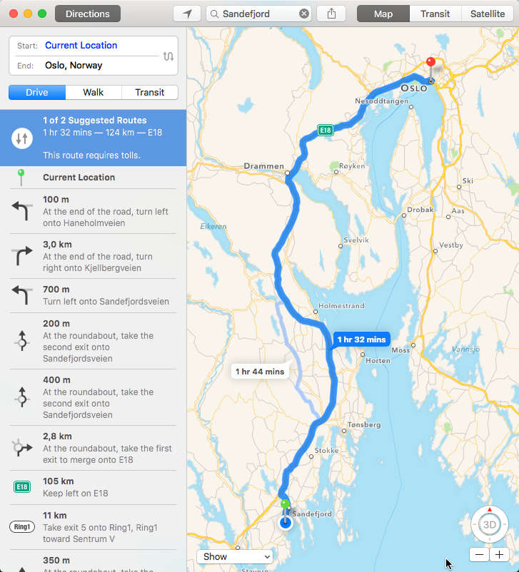
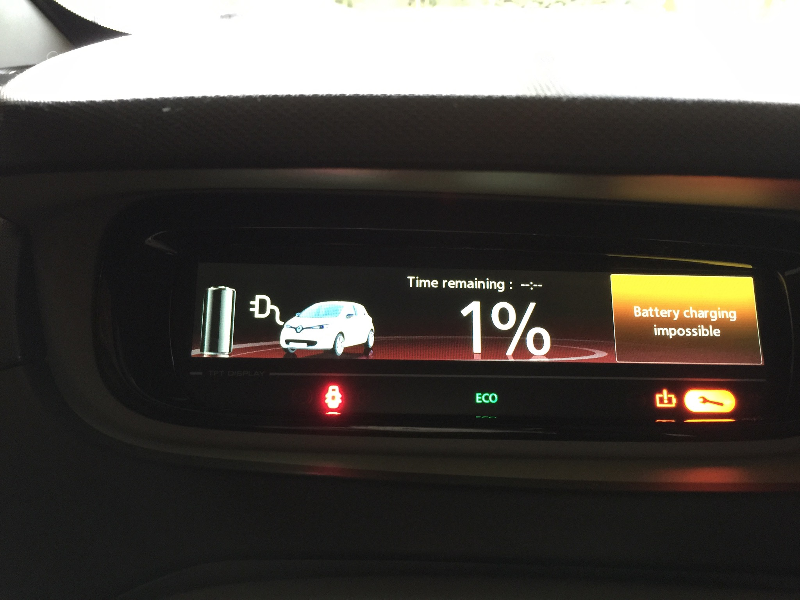
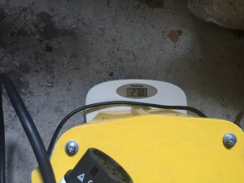
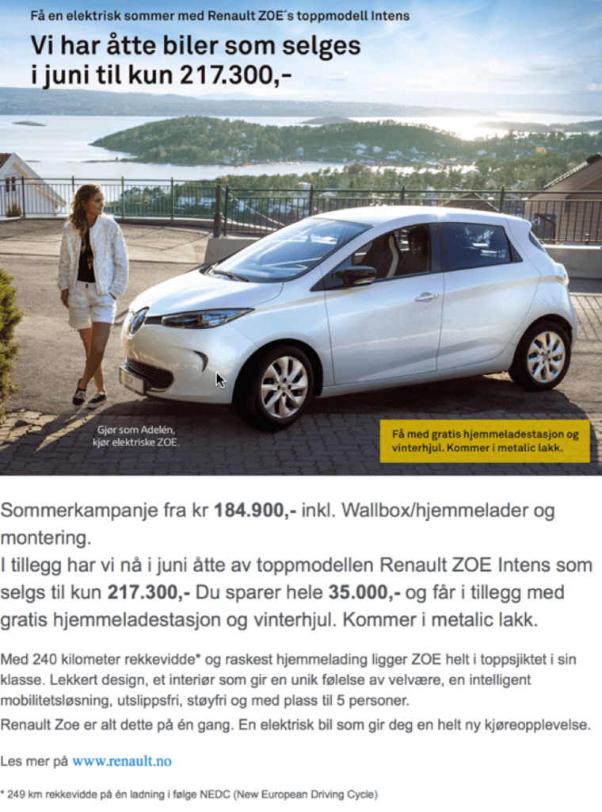

1st of January 2015 I started working in Oslo, Norway. About 124 kilometres from where I live; Sandefjord.

I started off with taking the bus. Did that for a couple of months and found it to be sub-optimal with trying to work on the bus on the way in and back, seing that it was constantly crammed going back. I swapped to train to try if that would be more optimal. Sure, the comfort was way better - but had the downside of me walking to take the bus to take me to the train. Ended up being an end-to-end travel of about 3 hours each way. Compared to 2.5 hours with the bus (including walking to the bus and to the office from the bus), which was still a lot. We only had one car at the time and my wife needed it during the days.

# In with the electric

We have a pretty good insentivised deal in Norway for electric cars. There is no sales tax on them, making them a better deal than their carbonfuel based counterparts. In addition we have other good deals with free parking on public parking spaces and also no toll for toll based roads. I therefor started thinking about buying an electric. Did the math and figured a car loan would in fact be cheaper than taking the bus or the train. In fact a whole 1000 Norwegian Kroners (about 130 USD or 110 Euros). And the best part, I could save a lot of time. Another benefit is that electrics can drive in the bus-lane - meaning you don’t have to get stuck in traffic. There are some local changes to this, but its a question about timing - when you drive, but still in place. With all this upside, what could possibly go wrong. <>Having absolutely no experience with electric cars, but have owner a bunch of regular gas and diesel based cars over the years - I jumped into it with the wrong goggles. I didn’t look too much around as most cars really didn’t have the range I needed, except for Tesla - but even in Norway these are very expensive. I know people argue they aren’t, with all the benefits - but a car half that price is still half that price with the benefits on top. So I set out to find something not Tesla with enough range to get me one way. I was counting on being able to charge when I was at work - giving me a full 8 hour charge. Seeing that the infrastructure was in place in Oslo, I was willing to take this gamble.

After reading a bit about a few cars, I found the Renault Zoe to be the most interesting from a range perspective. Unlike the competitors, it had gotten reviews claiming the range to be accurate to what they were promising; 240 kilometers on one charge. I even stumbled upon [this](http://evworld.com/news.cfm?newsid=28556) article, claiming it had almost unnoticable drops in performance in -25 degrees celcius. Everything was pointing towards it. They even had a deal were you could get it with a home super charger included in the price.

I had my testdrive of the car on the 28th of April 2015. Found the car a nice drive, but found it weird that I had to stop for a 45 minute charge halfway to Oslo. The battery had dropped to 20%. I charged and drove it in, parked it for charging for the day. Called the dealer and explained my situation and the salesguy told me to drive it in ECO, which would prevent the car from going faster than 96 km/h. This is were I go; OK and then WTF.. But willing to do what he said when I drove back, I managed to get back - but the display said there only was 15 kilometers left on the battery. Sure, it was a bit confused since its averaging. At this point I knew little about the car and was willing to except that it might be displaying wrong information due to me not driving ECO in and then ECO back. Messed up the statistics, kinda. Did point this out, and the salesguy was surprised.

I was skeptic, to say the least. But had the car for a couple of days for test driving, this time only driving ECO and proved a couple of times it would make it all the way in. So I decided to buy one.

# Got the car...

13th of May 2015; super excited. Picked up the car. The installer of the super charger thingy came the day before - all set. Since I was going to charge in different locations, I did order the car to come with a transformer that was able to transform from regular 240 volts to the 400 volts the car needed and also convert whatever it needed to convert. This was not ready from the manufacturer and I was promised to get this in August. Which was perfectly fine for me, as I could charge on the way home if I couldn’t find a charger that was compatible in Oslo and still save time on my travel in comparison to the bus and train options. The compatibility question is related to the volts but also the fact that it needs 3 phase charging and the plug being a [Type 2 plug](https://en.wikipedia.org/wiki/IEC_62196#VDE-AR-E_2623-2-2).

# A week later

I don’t travel the distance to the office every day. Some weeks 2 days, others 3 and occassional 1 day a week. So I didn’t get into trouble straight away, due to this fact. 19th of May I drove the car in and found a public charging pole and plugged my car in. Shortly after it said “Battery charging impossible” in the display.

Pretty non informative message to get, and it didn’t help to drive to a charger I knew worked. Same message. Anyways, I ended up having to get the car and me picked up by a dealer in Oslo. They plugged in the car to their charger and the message went away. Apparently this happens from time to time. The car then needs to reset its software (turn off the car and wait for a minute or so).

# First death

Yes, you read that right; first… The car died on the 29th of May. Not full two weeks after I got it. They had it for almost a full month, claiming to have swapped out the engine and had visitors from France and what not. That may very well be true, but a full month. Really. For a brand new product. Impressive. They hadn’t really found the problem, just swapped out everything. I use the car till I go on my holiday on 11th of June.

# Second death

Yup, there was a second one. Got back from holiday and went on a work related trip to the US. I drove the car to the airport, which is farther than Oslo - so I had to charge on the way to get there. Parked it at the airport. Got back from the trip on the 3rd of August. Drove the car to the nearest super charger. It didn’t work for some reason. Drove to a second, got the famous message. Drove to a third, still - same message. Tried “resetting” the car. Googled for help - nothing. I had enough charge to drive to the Oslo dealer, did so. No magic charge could wake the charging unit to life.<>This time it took 5 weeks in the garage. But now they had found the reason for the car dying, some condensator internally not withstanding the type of power we have in Norway is what I’m being told.

# Now what

At this point I’m beginning to really become desperate and annoyed. While waiting for the car during its second death. I contact the dealer on the 17th of August to hear about the transformer thing that was supposed to show up during August. Figured I had to have some dialogue with them and try to get my own mood better. The message back is; it will be delayed for another 2-3 months.

# A year has passed...

… and then some, since I bought the car. It has not died on me since its second death. But it does occassionally say “Battery charging impossible”. And its just completely random. <>I still have not gotten my transformer. But I have a massive brick with me that does the job, almost.

It weighs in at 27kilograms. So not a lightweighter.

And it does only support 10 ampére charging. Which makes it take some 16 hours to charge when I drove it winter time and had just a few percent of charge left in the battery.

# The range lie

Lets bring the story back to the title. Ok. I’ve been messed with quite a bit by Renault and the local car dealer; BilService here in Sandefjord. I’ve been served lies upon lies related to both the performance of the car, range, delivery dates and all. But the biggest of them all is related to the range. And that was actually what got me started on this. I got an email yesterday with an advertisement for Zoe from the local car dealer. Again promoting the awesome 240 kilometers of range of the car. This time with a \* next to the 240 kilometers. Me hoping that meant they were going to be more honest, but no.. They actually pointed out that it was 249 kilometers according to the [NEDC](https://en.wikipedia.org/wiki/New_European_Driving_Cycle) (New European Driving Cycle). The ad is in Norwegian, but it shouldn’t be hard to get the gist of it.

Having an experience were I see the range be more in the line of 150kilometers on a sunny day with high temperatures and next to no wind resistance and on a winters day with sub zero (celsius) its more in line of 110-130 kilometers, depending on air moistness and all. Added on top that I get the summer range if I drive in ECO with maximum speed of 96 km/h and for the winter range I have to stay at maximum of 90 km/h - there is something really fishy with how these cars are at least being marketed. When I buy a car, no matter what car, I’m not expecting it to be driven in a magical way to get from A to B. I also don’t expect it to have imaginary performance numbers in the lines of “if you drove the car off a cliff and fell for 240 kilometers, you would be able to make the range”. If I were to ever make that range, I think I would have to drive the car at a speed of 50 km/h. I think this is a big fat lie. Renault has yet to come with any excuse to me as a consumer of their products.

The best part, I think… I asked the dealer about the transformer; again… Almost 3 weeks ago, with a more annoyed tone from me. The answer I got was that he could see that I was on the list for the following week. Now, 2 weeks later - I’m just writing down on the “keeping score card” - another lie.

Fantastic.

And its a shame, the car is a nice drive. But if I could turn it back in I would - in fact I was in dialogue with the authorities; Norwegian Consumer Advice - they basically said it was hard to do anything with the situation, just based on the fact that the manufacturer has responded and done “… what they can…” to help me out. I’m now stuck with a product I kinda hate. And the awesome part; the battery quality will deteriorate - lithium based batteries has a tendency to go to 70% capacity after 1000 charging cycles. So that is brilliant when I was hoping to almost make close to one full cycle per day traveling rather than 2. All my math based on a lie, and I’m the one having to pay for it. Thank you Renault. Guess I won’t be your customer for long - nor the local dealer; BilService. Its the worst consumer experience I’ve ever had - I hope you don’t run into this.

Edit: I don’t do these kinds of posts – and trust me, I would’ve preferred not to this time either. But I don’t really know any other way. I’m frustrated, I’ve got a product that is not delivering on a promise, a manufacturer who is not in dialogue mode at all, a car dealer who is just trying to push the problem away, authorities basically saying I’m stuck. I know this is not the ideal way to deal with these things. I could “lawyer up”, but that can easily become expensive. So I don’t know.
