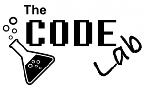

I’ve been wanting to try out a new format, or at least a new format for me; live interactive webcast. I got inspired when I saw some ex-colleagues of mine started something called "[Kodepanelet](http://kodepanelet.no)" and figured I had to do something similar. The goal is to have a one hour show on a regular basis where anyone can chime in on social media and ask technical questions and I’ll try to be as agile as possible answering, or probably preferably show. Some things I can answer live - other things might need preparation for a later show, or a follow up in a blogpost or similar. This part is still a bit fuzzy. To be honest, since this is all new and I’m trying something out - the format will more than likely change over time.

The concept is called “The Code Lab”;

I will be using the Facebook live video streaming system for this and you’ll find the Facebook page for the concept [here](http://thecodelab.tv/).

# Details

First airing will be on Friday the 4th of November @ 13:00 CET (1PM), [here](http://thecodelab.tv/).

# What can you expect?

First of all, this is supposed to be for software developers. And I can’t do more than I know or can easily acquire knowledge on. My background stretches from games development including graphics - low level programming to line of business applications and architecting highly available durable and scalable systems. I also have a knack for process and how to build teams. I consider myself pretty open-minded, and as a result I’ve always been all over the place when it comes to platforms. These days I find that I am probably most experienced in macOS and Windows, but an apprentice in Linux - trying to gain more experience there. I try to be polyglot in languages, but have most experience in C/C++, C# and JavaScript. Thrive in the backend as well as the frontend and loves my patterns and eat my SOLIDs for breakfast. I focus a lot of my time on cloud, and specifically Azure. Containers, MicroServices and in general decoupled software is something I am really passionate about.</>

# How can you help?

Content is always king - I’m hoping people find this interesting and want to jump in with good questions. To get the topics right, there is a survey on Facebook

# Health warning

If you’re out to troll me, I’ll try to ignore you. :)
