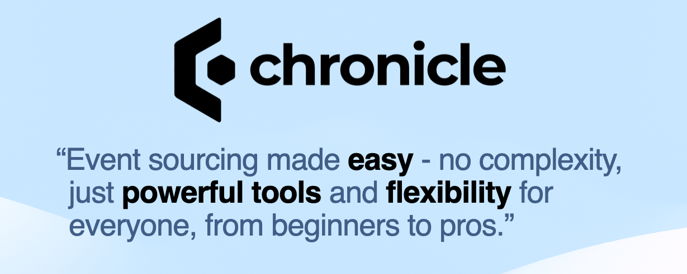

## A bit late...

Back in December 2015, I created an organization called **Cratis** on GitHub.
At the time, I was trying to reboot the efforts put into a project called [Bifrost](https://github.com/einari/bifrost).
The reboot was supposed to split up the original project into more focused parts.

A couple of years later, we started a company called Dolittle and the combined work of
Bifrost and what I had done for Cratis at the time became the foundation for the company.

I left Dolittle in late 2021 and shortly after started picking up Cratis again at my
new employer. I was going back to reboot mode again, figuring out what worked and what
didn't.

At the time of writing, we are at version 10-something of the project Chronicle, and 15-something
for ApplicationModel and 6 and beyond for Fundamentals. I figured, it was probably time to announce
to the world what we're up to :)

I've been holding back on telling the world for quite some time, trying to polish everything as much
as we could before speaking more about things. I know, very silly thing to do, just get it out there!

## Why

Throughout my career, I've always worked on creating software libraries, frameworks and tools
used by other developers, with the goal of making other developers more productive in delivering
their business value. I find great personal pleasure in trying to help other devs achieve more.
At the same time, I also thrive on challenging the status quo, by trying to take other perspectives
on how we write software.

For the last 15 or so years, I've been down the rabbit hole called event sourcing, CQRS and other
patterns and practices that I find make a lot of sense. This was the foundation for Bifrost and later
the company Dolittle as well. Our goal has been to democratize these concepts which have yet to become
mainstream. And this is still what Cratis is all about.

## What

The original Bifrost project became an all encompassing framework that solved way too many things and
became a mastodon that took over. It had event sourcing in it, implementations for commands and query pipelines.
And it was very opinionated. It would slap you on the wrist when you did something the wrong way, and
it was painful enough so that you didn't do it again. But it lacked flexibility and the ability to play
nicer with other things.

With Cratis (Latin for framework) we're taking a slightly different approach.
First of all we recognize that it shouldn't be a mastodon with all kinds of concepts mashed into one.

Secondly, we want to not force you to have to learn everything from scratch. This means that we
are less opinionated in some parts.

And thirdly, we want to play better with existing libraries and tools you're already using.

So what is Cratis all about? At the time of writing, we focus most of our time on 3 repositories;
**Chronicle**, **ApplicationModel**, **Fundamentals**

### Chronicle

Cratis Chronicle is an Event Sourcing database built with ease of use, productivity, compliance and maintainability in mind.
It provides the core server, referred to as the Kernel with a .NET client SDK to access it and tooling built into it.

Chronicle is our main "product", the crown jewel of the Cratis universe. Most of the effort going into the other things
feed Chronicle. We do dog-food everything inside Chronicle, it is how we close the feedback loop on everything we do.

### Application Model

The Cratis Application model represents an opinionated approach to building consistent applications based on the concepts behind CQRS.
It offers extensions for different frameworks and is built on top of ASP.NET Core. One of the traits the application model has
is the bridging between the backend and the frontend. The application model provides a tool, called ProxyGenerator that generates
TypeScript code for recognized artifacts matching the criteria of what is considered a **command** or a **query**.

### Fundamentals

The Cratis fundamentals holds generic reusable helpers, utilities and tools that aims at solving common problems and help developers
be more productive. Fundamentals offers functionality for .NET and JavaScript environments.
It is not a goal to have parity, as the different environments offer different building blocks.

You should look at it as a convenience layer on top of the existing base environment you're running in.

## How

Our site; [https://cratis.io](https://cratis.io) holds the documentation for the different projects.
In addition to that we have a focused [Samples repository](https://github.com/cratis/samples) we're building out.

Moving forward, we will focus more effort on these areas and other learning material to make it easy to get started.

We've recently set up a [Discord server](https://discord.gg/kt4AMpV8WV) that you can join. We also welcome discussions
on GitHub in our discussions there or welcome any issues you might have with open arms and we'll respond as fast as we
can.

Everything is of course open-source and found at 8https://github.com/cratis](https://github.com/cratis).

## Summary

In summary, it kinda feels early days, even though we've been at it for years. If you combine all our efforts for the
last 15 years of experience developing different solutions like Cratis is all about and our experience in using it in
production for clients and employers, it is so far from early days.

For our crown jewel; Chronicle, I'll leave with this:

