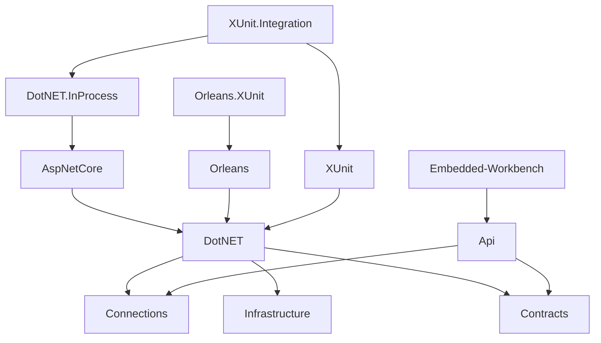

## Improving DevEx

We have the following core principles of how we approach developing any public facing APIs in Cratis:

- APIs should be lovable
- Provide sane defaults but make them flexible, extensible and overridable
- Consistency is king
- It should be easy to things right, hard to do things wrong
- Never expose more than is needed

With the [Chronicle](https://github.com/cratis/chronicle) project we've had a couple of challenges where
we basically have failed to deliver on the 2 last principles.

### What we broke

The core .NET Client leverages gRPC to connect to what we call the **Kernel**, the server side of Chronicle.
All gRPC contracts are defined in a code-first manner, thanks to the [protobuf-net.Grpc](https://github.com/protobuf-net/protobuf-net.Grpc) project.

This means that we need to have the contract definitions tag along with our client.

When doing that we introduce a couple of issues;

- Things that should not be visible to the outside, becomes very visible
- Constructs with the same name show up in multiple namespaces and developers can pick the wrong type

By exposing more than we need, we basically create a larger API surface that brings with it confusion
to consumers, but also potential more work for us to maintain if people start relying on it.

The second thing is the confusion of development tools automatically showing up with code suggestions
and you as a developer not knowing what to pick and you get the frustration of compile time errors.

### The Problem

A few months (quite a few months actually) back we started looking at how to remedy this.
It all started with the idea; this is easy, we'll just merge the assemblies and internalize the things
we don't want to expose.

Turns out for a number of reasons, this was much harder to do.

We're trying to save precious development time and build smarter, not harder. So we keep a keen eye on
how we can structure things in a way were we reuse when possible and it makes sense.

An example of this is our REST API. It is built to be used in the following scenarios:

- Embedded in the **Kernel** with feature toggling
- Run as a stand-alone container
- Be able to embed it directly into a client as part of the running client for the embedded Workbench experience

In addition, we need to keep an eye on what has dependencies to what and not create dependencies in
the wrong direction or create couplings that are wrong and makes it hard to maintain.

For instance, the **Kernel** should never have a dependency to anything used by a client.

However, when the API runs as a stand-alone, we do not want to have to do the heavy lifting of
how we connect to the **Kernel**, which is also true when running the API for the Workbench
embedded in the client. But for the embedded part it should reuse the connectivity set up by
the .NET client.

Dependency arrows are all over the place, and yeah, it becomes complex when we want to deliver on all
these promises and build smart at the same time.

We have split out the different building blocks to be able to achieve this.

With all our different client types we end up with a dependency graph that looks like this:

## The Remedy

Back to solving it properly. We tried out a bunch of different solutions but ended up using
[ILRepack](https://github.com/gluck/il-repack) with the [ILRepack.Lib.MSBuild.Task](https://github.com/ravibpatel/ILRepack.Lib.MSBuild.Task) on top.

It provided the flexibility we needed for this to work. However, it didn't provide is with all the magic
we needed.

Our InProcess client packages needs the **Kernel** to work. The internal **Kernel** APIs are not something
we want to have exposed to the developers, talk about confusion, that would escalate that problem dramatically.
Not to mention a massive API we would all of a sudden implicitly have to support and version.

This is obviously something to merge and internalize into the InProcess assembly.

Chronicle is built using [Microsoft Orleans](https://learn.microsoft.com/en-us/dotnet/orleans/overview).
Orleans has a discovery mechanism for discovering artifacts automatically at runtime.
When adding the Orleans SDK to a project it adds an attribute `[AssemblyPart]` to the assembly and it
then searches for assemblies marked with this to be able to find what it needs.

This is all fine when you don't merge a bunch of these assemblies together. The ILRepack tool
will correctly just take all of these attributes and put it into the final result. At runtime you
will then get into problems, because none of these assemblies exist anymore. We therefor had to
create a tool that removes these.

Another problem we ran into was that it was so easy to expose something that was supposed to be internal
to the public, the ILRepack tool would then not internalize these types. To help and protect ourselves,
we then created a tool that verifies that we don't actually do this. The tool then basically runs through
all types in an assembly that is supposed to be internalized and then sees if they have become
public. If they are public, break the build.

The following is the flow we came up with:

Unfortunately, our challenges didn't stop there.

Turns out that with our code-first approach for the gRPC contracts and they becoming internalized, the
default `ClientFactory` that comes with the code-first gRPC library was not able to actually create
instances of the client implementations.

We had to do two things; create the client implementations at build time and provide a custom client factory
that knew how to find these implementations and use them if they were there.

For the foundational .NET Client, which most other clients then relies on, had to have the following
flow.

## Conclusion

Creating something that is lovable, hard to do wrong and putting developers in the pit of success is hard work.
And to be honest, it should be. We should take pride in creating things that are to be used by others.
DevEx is just another form of UX, you have users in the form of developers and they deserve the best experience
you can provide. Besides, you will help yourself as well by not having to support more than needed due
to clarity in the API surface. Hopefully it also leads to happier consumers of the things you create,
which means they will be a natural advocate.

Due to all this complexity, we had to write a [complete guide](https://www.cratis.io/docs/Chronicle/contributing/clients/internalization.html) on all the details of how this works.
